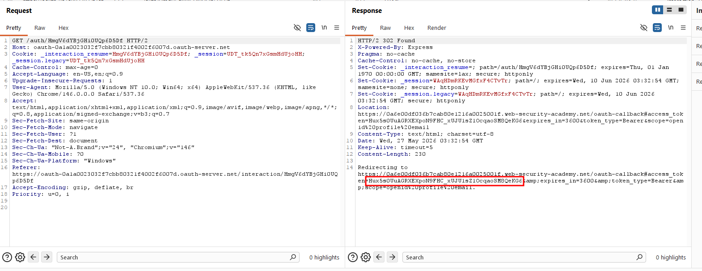

# Oauth

## **Lab: Authentication bypass via OAuth implicit flow**

[Lab: Authentication bypass via OAuth implicit flow | Web Security Academy](https://portswigger.net/web-security/oauth/lab-oauth-authentication-bypass-via-oauth-implicit-flow)

- Sau khi đăng nhập bằng tài khoản được cung cấp `wiener:peter`, em tiến hành quan sát luồng OAuth của ứng dụng. Ứng dụng sử dụng **Implicit Grant Type**, trong đó OAuth server trả trực tiếp `access_token` về phía client sau khi người dùng đăng nhập thành công.
    - POC
        
        
        
- Tiếp tục phân tích request xác thực của ứng dụng, em nhận thấy endpoint `/authenticate` nhận dữ liệu dạng JSON gồm `email`, `username` và `token`:
    - POC
        
        
        
- Vấn đề chỗ này là code be hoàn toàn không kiểm tra token thuộc về ai và gán session theo email gửi trong request. Nhờ vậy, em có được session id của user khác (`carlos`)
    - POC
        
        
        
- Thực hiện dùng session id trên và hoàn thành giải lab
    - POC
        
        